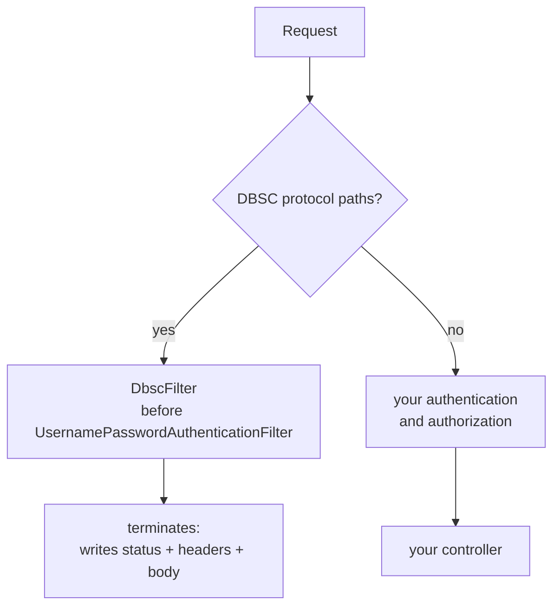

# spring-dbsc

[](https://github.com/yuukioosaka/spring-dbsc/actions/workflows/build.yml)
[](./LICENSE)

A Spring Boot **library** implementation of **DBSC (Device Bound Session
Credentials)**, built against the [W3C draft](https://w3c.github.io/webappsec-dbsc/)
and the [`dbsc-toolkit`](https://www.npmjs.com/package/dbsc-toolkit) protocol
specification.

This artifact is meant to be **embedded in an existing Spring Boot application**:
it ships no `@SpringBootApplication` and no controllers. You add it as a
dependency, call `bind()` from your own login route, and wire one filter into your
own security chain.

The point of DBSC: a session cookie stolen off the wire is useless on another
device, because the session is bound to a private key that never leaves the
browser's hardware. When the owner's browser refreshes the binding and the
attacker's device cannot produce the signature, the session is demoted to `none`
and the theft is reported as `session_stolen`.

## What's implemented

| Area | Status |
|---|---|
| Native protocol (Chromium, spec 02) | ✅ registration, refresh, well-known document |
| Hardware-backed key binding (TPM / Secure Enclave) | ✅ `ES256` + `RS256` |
| Atomic challenge consumption | ✅ in-memory + JDBC |
| Tier model + demotion-on-failure | ✅ `dbsc` / `none` |
| Telemetry events | ✅ 6 event types |
| Rate limiting | ✅ per-IP, with a separate failure budget |
| DPoP (spec 10) | ❌ out of scope — an orthogonal layer |

**Test status: 72 tests passing**, including the toolkit's language-neutral
conformance vectors (`registration-header`, `registration`, `refresh`) replayed
through the real engine.

## The protection model

DBSC — the [W3C draft](https://w3c.github.io/webappsec-dbsc/) and what Chromium
implements — is what this library implements, and this library implements *only*
that. The browser mints a key in **hardware-backed, non-extractable storage**, and
no script on the page can ever read or call it. Registering a session therefore
requires **no client code at all**: sending `Secure-Session-Registration` is the
whole handshake.

That is the guarantee, stated precisely: an attacker who steals the session cookie
cannot produce a refresh signature, and the browser cannot be made to produce one
for them. Three properties of the implementation carry it.

**A session's key is the session's key.** The key is stored once per `sessionId`
(`DeviceKey` has no other identity — re-registering replaces it), and registration
is refused outright with `SESSION_ALREADY_REGISTERED` when a key is already
present. There is no second, weaker key type and no path by which a
script-readable credential can stand in for a hardware one.

**Demotion on a failed refresh is the theft response.** A refresh whose signature
fails consumes the challenge, moves the session to `tier: none`, and emits
`session_stolen` — and the key is deliberately **kept**, because it is what makes
the next failure recognisable as a replay. The stored tier is therefore
authoritative: a key sets the *ceiling* a session can reach, not whether it is
currently protected. `dbsc.tierFor(sessionId)` reports `dbsc` only while the
session is actually trustworthy.

**The tier model has two values, not three.** `dbsc` means a hardware-backed key
is registered; `none` means nothing is bound, or a refresh signature failed. There
is no intermediate or weaker tier, and a stored value the library does not
recognise reads as `none` rather than being trusted.

### What the library does not do

Two things are easy to assume from the name, and both are false here:

- **It does not guard your routes.** No filter verifies a per-request proof. The
  protocol surface (`/dbsc/registration`, `/dbsc/refresh`,
  `/.well-known/device-bound-sessions`) is all the library serves, and it does not
  touch any other path. Your own authentication and authorization remain the only
  thing standing in front of your endpoints.
- **It does not sign anything per request.** DBSC has no per-request proof to
  verify: the browser signs only when it registers and when it refreshes, and the
  signature never leaves the browser's own protocol flow. What the library gives
  you is **freshness** — a session whose browser has stopped proving possession
  gets demoted — so the security decision available to you is "is this session's
  tier currently `dbsc`?", not "did this request carry a valid proof?".

Wiring a DBSC session only makes an endpoint **DBSC-aware** if you make it so:
gate that endpoint on `dbsc.sessionFor(request)` / `dbsc.tierFor(sessionId)` (see
[Act on the tier](#act-on-the-tier)). Adopting the library never silently changes
the behaviour of an existing endpoint.

## Requirements

The library is compiled at the **Java 17** release level, so its class files load on
JDK 17 and every later JDK — 17, 21 and 25 all work. Java 17 is the lowest JDK Spring
Boot 3.5 supports, and it is the CI baseline.

Spring Boot 3.x.x, 4.x.x are the tested versions.

## Getting Started

### 1. Add the dependency

```xml
<dependency>
  <groupId>click.yukio.dbsc</groupId>
  <artifactId>spring-dbsc</artifactId>
  <version>0.5.0</version>
</dependency>
```

That is the whole installation. A normal Boot app picks up `DbscAutoConfiguration`
from the JAR's `META-INF/spring/org.springframework.boot.autoconfigure.AutoConfiguration.imports`
— no extra annotation.

### 2. Wire `DbscFilter` into your chain

The library ships **one `OncePerRequestFilter` bean and no `SecurityFilterChain`.**
Nothing is registered into Spring Security for you, because *where* the filter sits,
which paths bypass authentication, and what authorization runs elsewhere in the chain
are policy decisions that belong to your application. A library-supplied chain would
either collide with yours (two chains matching `/**` is a hard startup error) or,
worse, be kept and silently replace your authorization rules.

`DbscFilter` arrives as a bean named `dbscFilter` from `DbscFilterConfiguration`.
Put it in **your** chain — usually its own protocol chain, so the routes it serves
stay unauthenticated:

```java
@Configuration
@EnableWebSecurity
public class MySecurityConfig {

    /** Protocol routes: driven by the browser, before any session exists. */
    @Bean
    @Order(0)
    public SecurityFilterChain dbscProtocolChain(HttpSecurity http, DbscFilter dbscFilter)
            throws Exception {
        http
                .securityMatcher(new OrRequestMatcher(
                        new AntPathRequestMatcher("/dbsc/**"),
                        new AntPathRequestMatcher("/.well-known/device-bound-sessions")))
                .authorizeHttpRequests(auth -> auth.anyRequest().permitAll())
                .sessionManagement(s -> s.sessionCreationPolicy(SessionCreationPolicy.STATELESS))
                .csrf(CsrfConfigurer::disable)
                .addFilterBefore(dbscFilter, UsernamePasswordAuthenticationFilter.class);
        return http.build();
    }

    /** Your application, under your own authentication and authorization. */
    @Bean
    @Order(1)
    public SecurityFilterChain appChain(HttpSecurity http) throws Exception {
        http
                .authorizeHttpRequests(auth -> auth
                        .requestMatchers("/login", "/css/**").permitAll()
                        .requestMatchers("/api/transfer").authenticated());
        return http.build();
    }
}
```

The three details that actually matter, and how each one fails:

| Detail | If you get it wrong |
|---|---|
| `OrRequestMatcher` for the protocol paths — `securityMatcher()` **sets**, it does not accumulate | Only the last path is matched; the rest fall through to your chain, which answers a Spring 403 before `DbscFilter` runs |
| `addFilterBefore(..., UsernamePasswordAuthenticationFilter.class)` **and** CSRF off on the protocol chain | The browser's registration POST is rejected by CSRF first, or Security's entry point turns DBSC's 403 into a 401 — which Chromium treats as fatal and deletes the session |
| The bean is registered in **one** chain only | `OncePerRequestFilter` records itself in a request attribute, so the same instance in a second chain silently skips it |

Anchoring on `UsernamePasswordAuthenticationFilter.class` is **not** a dependency on
form login. `HttpSecurity` registers that class as an ordering *position* when it is
constructed; `formLogin()` merely adds an instance at that position. Only an anchor
naming a filter **instance** would require the filter to exist, so this is valid for
OIDC, HTTP Basic, pre-authentication, and no authentication at all.

Boot also auto-registers every `Filter` bean as a plain servlet filter *outside* the
security chain, which would run the DBSC filter a second time on every path. Disable
that:

```java
@Bean
FilterRegistrationBean<DbscFilter> dbscFilterRegistration(DbscFilter filter) {
    var registration = new FilterRegistrationBean<>(filter);
    registration.setEnabled(false);
    return registration;
}
```

One instance per chain. `OncePerRequestFilter` records that it has run in a request
attribute, so registering the *same* instance in two chains makes the second chain
silently skip it.

If you do not use Spring Security at all, see
[No Spring Security at all](#no-spring-security-at-all) — `DbscFilter` is not a
Security component and registers as a plain servlet filter.

### Examples

#### OIDC / `oauth2Login()`

DBSC binds a session that already exists, so it composes with any authentication
mechanism. Put `bind()` in a success handler — a redirect flow never reaches a
controller, so a success handler is the only place that sees the request, the response
and the authenticated principal together:

```java
@Configuration
@EnableWebSecurity
public class OidcSecurityConfig {

    @Bean
    SecurityFilterChain appChain(HttpSecurity http, DbscService dbsc) throws Exception {
        http
                .authorizeHttpRequests(auth -> auth
                        .requestMatchers("/login/**", "/oauth2/**").permitAll()
                        .requestMatchers("/api/transfer").authenticated()
                        .anyRequest().authenticated())
                .oauth2Login(oauth2 -> oauth2.successHandler((request, response, auth) -> {
                    dbsc.bind(request.getSession().getId(), auth.getName(),
                              86_400_000L, request, response);
                    response.sendRedirect("/");
                }));
        return http.build();
    }
}
```

`request.getSession().getId()` is the right session id whenever the app keeps an
`HttpSession`. Note the ordering: `bind()` reads the session, so the session must
already exist at that point. In a success handler it does, because authentication
created it.

**The user id must not come from a mutable claim.** `auth.getName()` maps to whatever
the provider's `user-name-attribute` names, and for OIDC that should be `sub`. Using
`preferred_username` or `email` instead makes the binding change owner if the address
does — see `DemoOidcConfig.subjectAsName()` for the override.

If your app has no `HttpSession`, bind to whatever opaque id you already mint per
client — as in [the stateless example](#stateless-api--bearer-tokens) — rather than
inventing one for this.

##### The registration POST is speculative, and bounded

A registration offer is a guess. The server cannot know whether a browser supports
DBSC, whether the response will reach it, or whether the offer will be ignored — so
the offer is made and the outcome accepted either way. There is no retry loop and no
attempt to predict the browser's behaviour.

That guess is bounded by **`dbsc.bind-attempts`** (default `3`), counted in the
pre-registration cookie. If the header is advertised this many times without a
registration arriving, the server stops offering it and issues no further challenges
for that login. Raising it buys more chances at the cost of a challenge per extra
request; `0` disables the offer entirely.

Two consequences worth knowing:

- **Behind an OIDC or SAML callback the first offer can be wasted.** Chromium makes
  DBSC requests inherit the **initiator** of the request that produced them, and a
  callback's initiator is the identity provider. A registration POST issued in
  response to that response counts as cross-site, so the `SameSite=Lax` session
  cookie is withheld and Chromium logs
  `Registration returned challenge error response code` / `POST /dbsc/registration -> 403`.
  A server-side redirect (`302`/`303`) does not reset the initiator — only a
  navigation the browser issues itself does. The remaining attempts are what save
  the login: a later authenticated request from the same session carries the cookie,
  and the offer there succeeds.
- **Once a browser has registered, further offers cost it nothing.** A session that
  reaches `tier: dbsc` ignores the header, and the budget simply expires unused.

`DbscFilter` also re-offers the header itself on any authenticated request, so an
application that never calls `bind()` still gets registration so long as the session
record exists — the filter reuses the record's own user id and expiry rather than
inventing either. Calling `bind()` from the login route is still the recommended
entry point: it is what creates that record, and it is where the application's TTL
policy belongs.

#### Form login (password)

Form login owns the POST that ends authentication, so the binding has to be made from
the success handler there too:

```java
@Bean
SecurityFilterChain appChain(HttpSecurity http, DbscService dbsc) throws Exception {
    http
            .authorizeHttpRequests(auth -> auth
                    .requestMatchers("/login", "/css/**").permitAll()
                    .requestMatchers("/api/transfer").authenticated())
            .formLogin(form -> form
                    .loginPage("/login")
                    .successHandler((request, response, auth) -> {
                        dbsc.bind(request.getSession().getId(), auth.getName(),
                                  86_400_000L, request, response);
                        response.sendRedirect("/");
                    }))
            .logout(logout -> logout.logoutSuccessHandler((request, response, auth) ->
                    dbsc.sessionFor(request)
                            .ifPresent(s -> dbsc.terminate(s.id(), request, response))));
    return http.build();
}
```

`src/demo` is a complete, runnable form-login app over HTTPS, and
`src/demo/resources/README-DEMO.md` records the failure modes it exists to catch.

#### Stateless API / bearer tokens

With no HTTP session at all, choose a session id that is stable for the *client*, not
the request, and route the cookie through the response yourself:

```java
@PostMapping("/login")
public TokenResponse login(@RequestBody Credentials credentials,
                           HttpServletRequest request,
                           HttpServletResponse response) {
    var principal = authenticate(credentials);          // your own auth
    var sessionId = "sess_" + UUID.randomUUID();         // your own session store
    dbsc.bind(sessionId, principal.id(), 86_400_000L, request, response);
    return new TokenResponse(sessionId);
}
```

#### No Spring Security at all

`DbscFilter` is not a Security component — nothing in it touches a Security request
wrapper or context. Register it as a plain servlet filter:

```java
@Bean
FilterRegistrationBean<DbscFilter> dbscFilterRegistration(DbscFilter filter) {
    var registration = new FilterRegistrationBean<>(filter);
    registration.addUrlPatterns("/dbsc/*", "/.well-known/*");
    registration.setOrder(Ordered.HIGHEST_PRECEDENCE + 10);
    return registration;
}
```

### 3. Bind, terminate, act on the tier

Details and the reasoning are in
[Wiring it into your own app](#wiring-it-into-your-own-app); the short version:

- **`dbsc.bind(sessionId, userId, ttlMillis, request, response)`** — at the end of your
  login handler. Binding is idempotent per session; the browser does the rest of the
  native registration on its own. If your login runs behind a cross-site redirect
  (OIDC, SAML), the header may not survive that first response — the filter re-offers
  it on later authenticated requests, bounded by `bind-attempts`.
- **`dbsc.terminate(...)`** — on logout, so the browser forgets the binding instead of
  retrying against a dead session.
- **`dbsc.sessionFor(request)` / `dbsc.tierFor(sessionId)`** — the DBSC state your own
  code reads when it wants to require a bound session. See
  [Act on the tier](#act-on-the-tier).

## Architecture

The protocol is served by **one `OncePerRequestFilter` that your own Spring Security
chain invokes**, not by controllers:

| Component | Responsibility |
|---|---|
| `DbscFilter` | Owns every protocol route (`/dbsc/*`, `/.well-known/device-bound-sessions`). Terminates the chain for those paths; passes everything else through untouched. |

`DbscService` sits below it as the HTTP facade, and `DbscProtocolEngine` below that as
the protocol itself — neither depends on Spring Security. See
[How it is wired (and why)](#how-it-is-wired-and-why) for the reasoning. There is no
second filter: the library does not guard application routes.

## Running the tests

The build is on GitHub Actions:

- **[`build.yml`](./.github/workflows/build.yml)** — `mvn verify` on Java 17, 21 and 25
  (blocking) and 26 (experimental). Uploads the library JAR.
- **[`e2e.yml`](./.github/workflows/e2e.yml)** — boots two demo instances over HTTPS
  and runs `scripts/e2e.py` against them, then checks error-code coverage.

The E2E workflow exists because some scenarios are only reachable under test
conditions: the expiry checks need a tiny challenge TTL, and the throttling check
needs an instance whose rate-limit budget is small enough to exhaust on purpose
(the main demo's are set to 1000 so the suite's own deliberate failures do not
throttle the run that is testing them). At the production defaults the suite skips
those checks rather than testing them.

`scripts/check-error-coverage.py` is a gate, not a convenience: it fails the build
when an error code is defined but no scenario reaches it. Both `RATE_LIMITED` and
`INVALID_JWK` were reaching real code paths that nothing tested before it existed.

Locally:

```sh
mvn verify

# E2E, both instances (see src/demo/resources/README-DEMO.md for detail)
sh scripts/run-demos.sh
DBSC_CHALLENGE_TTL=2 DBSC_RATE_LIMIT_FAILURES=5 python3 scripts/e2e.py
python3 scripts/check-error-coverage.py
```

The web tests run against `DbscTestHostApplication` in `src/test` — a miniature
host app that stands in for yours: a login route that calls `bind()`, a `whoami`
route, a `payment` route, and a logout route. Read it first when wiring
the library up; it is the smallest complete integration.

## Wiring it into your own app

### 1. Get the auto-configuration on the classpath

The library ships `META-INF/spring/org.springframework.boot.autoconfigure.AutoConfiguration.imports`,
so a normal Boot app picks up `DbscAutoConfiguration` with no extra annotation —
just depend on the JAR.

If you disable Boot's auto-configuration, or want the wiring visible, import it
explicitly:

```java
@SpringBootApplication
@Import(DbscAutoConfiguration.class)
public class MyApplication { ... }
```

The auto-configuration applies whenever the JAR is on the classpath. There is no
enable/disable switch on the library itself — the way to turn DBSC off is to take
the dependency out, since a half-installed filter chain that starts but does not
work is a worse failure mode than an absent one.

### 2. Bind a session from your login route

DBSC does not authenticate. It **binds a session that already exists**, so the
call goes at the end of your existing login handler:

```java
@PostMapping("/login")
public Session login(HttpServletRequest request, HttpServletResponse response) {
    Session session = authenticate(request);       // your own auth
    dbsc.bind(session.id(), session.userId(), 86_400_000L, request, response);
    return session;
}
```

That single call persists the session record, sets the registration + challenge
cookies, and adds `Secure-Session-Registration`. Chromium then calls
`/dbsc/registration` on its own within about a second — there is no client code to
write for the native path.

**This call is optional but recommended.** `DbscFilter` also offers the header on any
request that reaches it with an authenticated session, so a login route you never
touch still gets a binding. Calling `bind()` yourself is still the better choice, for
two reasons: it records the session with *your* lifetime rather than the filter's
`session-ttl` default, and it keys the session by the id you choose instead of
`principal.getName()`. The filter's offer stops after `bind-attempts` (default `3`)
per login; a `bind()` call has no such budget.

On logout, call `dbsc.terminate(...)` so the browser forgets the binding
immediately instead of retrying against a dead session:

```java
@PostMapping("/logout")
public void logout(HttpServletRequest request, HttpServletResponse response) {
    dbsc.sessionFor(request).ifPresent(s -> dbsc.terminate(s.id(), request, response));
    invalidateYourOwnSession(request);
}
```

### 3. Act on the tier

There is nothing to declare and nothing to enable: the library does not guard routes.
Your authentication and authorization keep working exactly as they did, and DBSC is
**additional state** your own code can consult when a decision deserves it:

```java
@PostMapping("/api/transfer")
public ResponseEntity<?> transfer(@RequestBody Transfer body, HttpServletRequest request) {
    Optional<Session> session = dbsc.sessionFor(request);
    if (session.isEmpty() || dbsc.tierFor(session.get().id()) != ProtectionTier.DBSC) {
        // Signed in, but this browser is not proving possession of a bound key.
        return ResponseEntity.status(HttpStatus.FORBIDDEN).body(stepUpOrReauthenticate());
    }
    return transferService.execute(body);
}
```

Three things to be deliberate about in that check:

- **It is a step-up decision, not an authentication one.** A `dbsc` tier never
  substitutes for being authenticated; read it *in addition to* your own checks, as
  above.
- **`tierFor` is the live answer, not the value on the record.** It accounts for the
  refresh cadence and the grace window, so a session whose browser has stopped
  refreshing reads `none` — which is the demotion you are actually trying to surface.
- **Expect `none` to be normal.** A browser without DBSC support (or a user who has
  just logged in, before registration completes) is legitimately unbound, so decide in
  advance whether that is a hard refusal or a softer "verify again" prompt.

If your application cannot act on a weaker tier — for example a compliance rule that
says a stolen cookie must never be usable — say so explicitly rather than assuming the
handshake alone covers it: `bind()` and the routes are all the library does, and it is
application code like the block above that turns a bound session into an enforced one.

## How it is wired (and why)

DBSC is implemented as **one `OncePerRequestFilter`** rather than controllers,
and it runs inside the Spring Security chain because that is where your application
decides what is reachable:



Neither branch consults DBSC state: the protocol paths are served and stop there, and
everything else is your application's chain, unchanged. Gating an endpoint on the tier
is your code, not a filter — see [Act on the tier](#act-on-the-tier).

The reasons for a filter rather than controllers:

- **These are a protocol surface, not endpoints.** The routes must be reachable
  before any application session exists, and must answer with DBSC's own status
  contract. A filter that terminates the chain enforces that structurally: the
  routes cannot be re-mapped, shadowed by a peer controller, or re-secured.
- **403 vs 401 is load-bearing, and only a filter can guarantee it.** Chromium
  treats a 401 on the refresh route as fatal and terminates the session, so DBSC
  must answer 403. If Spring Security handled these paths itself it would answer
  401 first. `DbscFilter` is registered *before* Spring Security's authentication
  entry points precisely so nothing upstream can replace that status.
- **It owns no state the application needs to configure.** The filter is handed the
  session-agnostic protocol surface only, so it adds no ordering constraints to your
  chain beyond the one above and no policy of its own over your routes.

### Using your own `SecurityFilterChain`

That is the only way to use the library — [Getting Started](#getting-started) is the
full worked example, and the two chains there are the shape to copy. This section only
adds the reasoning behind the filter placement.

- **`dbscFilter` goes in the chain that owns the protocol paths, before
  authentication.** Security would otherwise answer 401 there, and Chromium treats 401
  on the refresh route as fatal. It belongs in exactly one chain.

And the detail that is easy to miss: **the protocol paths must be served by a chain with
CSRF disabled.** The browser's registration POST carries no CSRF token, so a chain that
applies CSRF to `/dbsc/**` rejects it before `DbscFilter` ever runs.

If you do not use Spring Security at all, see
[No Spring Security at all](#no-spring-security-at-all) — `DbscFilter` is not a Security
component and registers as a plain servlet filter.

### Replace the collaborators you have opinions about

`DbscAutoConfiguration` backs off with `@ConditionalOnMissingBean` on every
bean, so defining your own replaces the default. The ones most worth replacing:

| Bean | Default | Replace when |
|---|---|---|
| `StorageAdapter` | JDBC when a `DataSource` is present, else in-memory | You already have a key/session store — implement the interface; the only hard requirement is an **atomic** `consumeChallenge` |
| `RateLimiter` | In-memory, per-IP | You run more than one process (the in-memory limiter is per-JVM) — or you use a gateway/bucket you already have |
| `CookieScope` | Resolved from `secure` / `cookie-scope` / `cookie-domain` | You build cookie names or attributes yourself |
| `ChallengeService`, `DbscProtocolEngine`, `TelemetryPublisher` | Library defaults | You need different challenge or telemetry behaviour |
| `Clock` | `Clock.systemUTC()` | You need to freeze time. Override the bean **named `dbscClock`** (`@ConditionalOnMissingBean(name = "dbscClock")`) |

```java
@Bean
StorageAdapter dbscStorage(MyRedisClient redis) {
    return new RedisStorageAdapter(redis);   // must make consumeChallenge atomic
}
```

`DbscService` itself is also `@ConditionalOnMissingBean`, but it is a plain
facade — wrapping or replacing it is rarely worth it.

## Configuration

All keys are prefixed `dbsc`. Defaults match the toolkit spec.

| Key | Default | Notes |
|---|---|---|
| `secure` | `true` | `__Host-` cookies + `Secure`. **Turn off only for localhost HTTP** |
| `cookie-scope` | `host` | `site` enables multi-subdomain and requires `cookie-domain` |
| `cookie-domain` | — | e.g. `example.com`; required for `site` scope |
| `registration-path` | `/dbsc/registration` | what the registration header advertises |
| `refresh-path` | `/dbsc/refresh` | also the `refresh_url` in the JSON config |
| `binding-cookie-ttl` | `10m` | lifetime of the binding cookie, and the window after which an unrefreshed session demotes. Also the refresh cadence the browser settles into |
| `registration-cookie-ttl` | `24h` | lifetime of the pre-registration cookie carrying the session id |
| `challenge-ttl` | `5m` | lifetime of a challenge JTI |
| `refresh-grace` | `30s` | softens the freshness poll across a refresh |
| `session-ttl` | `7d` | default lifetime applied by `bind()` when the caller does not set one |
| `bind-attempts` | `3` | how many times a login may advertise the registration header before the offer is given up; `0` disables the filter's speculative offer |
| `rate-limit.enabled` | `true` | |
| `rate-limit.capacity` | `30` | per IP, per window |
| `rate-limit.failure-capacity` | `15` | **failed** attempts per IP, per window — trips long before `capacity` does |
| `rate-limit.window` | `1m` | |
| `storage` | `jdbc` when a `DataSource` is present | `memory` for tests and local dev only |
| `trust-forwarded-headers` | `false` | believe `X-Forwarded-For` / `X-Forwarded-Proto`. Leave off unless a reverse proxy is known to overwrite them — they drive the IP used for rate limiting |

### Storage

With a `DataSource` on the classpath, sessions, keys and challenges all live in the
database (`dbsc.storage: jdbc`).

For tests and local dev, `dbsc.storage: memory` swaps in a heap-backed store.
**Not for production**: every restart breaks live sessions, because the browser
still holds a cookie for a key the server no longer remembers.

```yaml
dbsc:
  storage: jdbc          # or: memory
  secure: true
  cookie-scope: site
  cookie-domain: example.com
```

#### Schema

The tables are created on startup by `JdbcStorageAdapter.initialize()`, which issues
`CREATE TABLE IF NOT EXISTS` and is safe to run on every boot. A fresh database needs
no setup.

That default is convenient, but in production the schema should be owned by a migration
tool (Flyway, Liquibase, or whatever the application already uses), for two reasons:

- The runtime database user otherwise needs **DDL rights**, which many production
  setups deliberately withhold.
- Schema changes then get reviewed, versioned and rolled out like every other change,
  instead of silently appearing on the first boot of a new release.

The DDL is shipped for exactly that, at
[`src/main/resources/db/migration/V1__dbsc_storage.sql`](./src/main/resources/db/migration/V1__dbsc_storage.sql):

| Table | Contents |
|---|---|
| `dbsc_sessions` | one row per bound session (`id` PK, `user_id`, `tier`, timestamps) |
| `dbsc_device_keys` | the registered hardware key it holds — `session_id` PK, so **one key per session** |
| `dbsc_challenges` | outstanding JTIs, with the `consumed` flag that makes consumption atomic |

The file is a plain `CREATE TABLE IF NOT EXISTS` migration: drop it into your
migration tool's directory, or run its statements however you already run schema
changes. It is **byte-identical** to what `initialize()` issues and both are
idempotent, so there is no conflict either way — applying it and then starting the app
leaves the schema unchanged, and you can adopt it on an existing deployment without a
baseline step.

The SQL is deliberately portable — no vendor-specific types, no sequences — so it works
on PostgreSQL, MySQL, MariaDB, H2 and SQL Server. Timestamps are `BIGINT` epoch
milliseconds throughout, matching how the protocol carries them.

If you would rather not carry the migration at all, `initialize()` is also safe to call
yourself from a schema-management hook — the DDL statements are quoted at the top of
`JdbcStorageAdapter`.

## Things worth knowing

A few behaviours are load-bearing and easy to get wrong if you reimplement or
extend this:

- **Never 401 on the refresh route.** Chromium ignores 401 there and the
  session silently dies. Every DBSC failure is 403, except a structurally incomplete
  request (400) and a tripped rate limit (429).
- **A failed refresh signature must consume the challenge and demote to
  `none`.** That demotion is the actual theft response, not a side effect.
- **`200` with no JSON body on a protocol route means opt-out**, and the browser
  drops the session. Always return the JSON config on success.
- **The `attributes` string in the JSON config must match the real
  `Set-Cookie` bytes**, so the browser's cookie matcher recognises it. It
  deliberately excludes `Max-Age`, which the spec's match set does not include.
- **A key can only be registered once per session.** A second registration is
  refused with `SESSION_ALREADY_REGISTERED`; re-binding means starting a new session.
- **`tier` is what makes a session protected, not the presence of a key.** A
  demoted session keeps its key on purpose (so a later failure is still recognisable
  as `session_stolen`), which is why `tierFor()` reads the stored tier rather than
  inferring protection from the key.

## License

[MIT](./LICENSE).
