# spring-dbsc

[](https://github.com/yuukioosaka/spring-dbsc/actions/workflows/build.yml)
[](./LICENSE)

A Spring Boot **library** implementation of **DBSC (Device Bound Session
Credentials)**, built against the [W3C draft](https://w3c.github.io/webappsec-dbsc/)
and the [`dbsc-toolkit`](https://www.npmjs.com/package/dbsc-toolkit) protocol
specification.

This artifact is meant to be **embedded in an existing Spring Boot application**:
it ships no `@SpringBootApplication` and no controllers. You add it as a
dependency, call `bind()` from your own login route, and add its filters to your
own security chain.

The point of DBSC: a session cookie stolen off the wire is useless on another
device, because the session is bound to a private key that never leaves the
browser's hardware. When the owner's browser refreshes the binding and the
attacker's device cannot produce the signature, the session is demoted to `none`
and the theft is reported as `session_stolen`.

## What's implemented

| Area | Status |
|---|---|
| Native protocol | ✅ registration, refresh, well-known document |
| Hardware-backed key binding (TPM / Secure Enclave) | ✅ `ES256` + `RS256` |
| Atomic challenge consumption | ✅ in-memory + JDBC + Redis |
| Tier model + demotion-on-failure | ✅ `dbsc` / `none` |
| Route guard | ✅ opt-in per route; refuses anything not currently `dbsc`, and a bound session that omits its DBSC cookies |
| Telemetry events | ✅ 7 event types |
| Credential rotation on refresh | ✅ always on; bounds how long a captured credential cookie is worth |
| Session scope rules | ✅ `scope.scope_specification` — include/exclude by domain and path |
| Refresh-initiator allow-list | ✅ `allowed_refresh_initiators`, closing the out-of-scope timing side channel |
| Application-session binding | ✅ the DBSC session id is bound to your own session id (`JSESSIONID`, Spring Session, …), so the guard can tell a client that never bound from one that dropped its DBSC cookies — see [What the guard actually decides](#what-the-guard-actually-decides) |
| Soft DBSC fallback | ✅ `dbsc-soft-sw.js` + `dbsc-soft-client.js` for browsers with no native support — a WebCrypto key in IndexedDB driving the same routes, refreshed from a Service Worker `fetch` hook. **On by default** (`dbsc.soft.enabled`); see [Soft DBSC](#soft-dbsc-the-fallback-for-browsers-without-native-support) |

## The protection model

DBSC — the [W3C draft](https://w3c.github.io/webappsec-dbsc/) and what Chromium
implements — is what this library implements, and this library implements *only*
that. The browser mints a key in **hardware-backed, non-extractable storage**, and
no script on the page can ever read or call it. Registering a session therefore
requires **no client code at all**: sending `Secure-Session-Registration` is the
whole handshake.

That is the guarantee, stated precisely: an attacker who steals the session cookie
cannot produce a refresh signature, and the browser cannot be made to produce one
for them. Three properties of the implementation carry it.

**A session's key is the session's key.** The key is stored once per `sessionId`
(`DeviceKey` has no other identity — re-registering replaces it), and registration
is refused outright with `SESSION_ALREADY_REGISTERED` when a key is already
present. There is no second, weaker key type and no path by which a
script-readable credential can stand in for a hardware one.

**Demotion on a failed refresh is the theft response.** A refresh whose signature
fails consumes the challenge, moves the session to `tier: none`, and emits
`session_stolen` — and the key is deliberately **kept**, because it is what makes
the next failure recognisable as a replay. The stored tier is therefore
authoritative: a key sets the *ceiling* a session can reach, not whether it is
currently protected. `dbsc.tierFor(sessionId)` reports `dbsc` only while the
session is actually trustworthy.

**The tier model has two values, not three.** `dbsc` means a hardware-backed key
is registered; `none` means nothing is bound, or a refresh signature failed. There
is no intermediate or weaker tier, and a stored value the library does not
recognise reads as `none` rather than being trusted.

**The credential cookie is worth one refresh window.** The session id never travels in a
cookie at all: `session_identifier` carries the id itself (spec §9.6) but names no cookie,
so the id exists only server-side and a lifted cookie jar contains no long-lived
credential. The one cookie that does travel is `__Host-auth_cookie`, named in
`credentials[]`, and its value is replaced on every successful refresh. A copy of it
therefore goes stale within one refresh rather than staying valid for the session's
lifetime. The one tunable is `dbsc.rotation-grace`, the window in which a retired
credential still resolves so a second tab does not break — and that window is itself
exposure. See [Credential rotation](#credential-rotation).

**The session is confined to the hosts and pages you name.** `scope.include_site`,
`scope.scope_specification` and `allowed_refresh_initiators` are instructions to the
browser, not checks this server performs: they decide where the credential is attached
and which out-of-scope callers may trigger a refresh. By default an out-of-scope
cross-origin fetch to a protected URL blocks on the refresh request, and the delay alone
reveals whether the user is logged in (spec §3.2) — so the initiator list is a security
control, not a convenience. See [Session scope](#session-scope).

### What the library does not do

Two things are easy to assume from the name, and both are false here:

- **It does not verify a per-request proof.** DBSC has none to verify: the browser
  signs only when it registers and when it refreshes, and that signature never
  leaves the browser's own protocol flow. What the library gives you is
  **freshness** — a session whose browser has stopped proving possession gets
  demoted — so the decision available to you is "is this session's tier currently
  `dbsc`?", not "did this request carry a valid proof?".
- **It does not authenticate, and it does not replace your authorization.** The
  guard refuses a request whose session is not currently DBSC-protected; it does
  not admit anyone, and it must not be the only thing in front of a route. Every
  route you guard still needs your own authentication, and DBSC's refusal is a
  step-up prompt rather than proof of who the caller is.

DBSC is **additive**: adopting the library never silently changes the behaviour of
an existing endpoint, because nothing is guarded until you declare `DbscGuardRoutes`,
and even then a client that never registered is allowed through unless you opt into
`dbsc.unregistered: deny`.

## Requirements

The library is compiled at the **Java 17** release level, so its class files load on
JDK 17 and every later JDK — 17, 21 and 25 all work. Java 17 is the lowest JDK Spring
Boot 3.5 supports, and it is the CI baseline.

Spring Boot 3.x.x, 4.x.x are the tested versions.

## Getting Started

### 1. Add the dependency

```xml
<dependency>
  <groupId>click.yukio.dbsc</groupId>
  <artifactId>spring-dbsc</artifactId>
  <version>0.7.0</version>
</dependency>
```

That is the whole installation. A normal Boot app picks up `DbscAutoConfiguration`
from the JAR's `META-INF/spring/org.springframework.boot.autoconfigure.AutoConfiguration.imports`
— no extra annotation.

### 2. Wire the DBSC filters into your chain

The library ships **three `OncePerRequestFilter` beans and no `SecurityFilterChain`** —
they are *not* wired into Security for you, and are not auto-registered as servlet
filters either, so a JAR that is merely on the classpath does nothing until you add
them. Nothing is registered into Spring Security for you, because *where* the filters
sit, which paths bypass authentication, and what authorization runs elsewhere in the
chain are policy decisions that belong to your application. A library-supplied chain
would either collide with yours (two chains matching `/**` is a hard startup error) or,
worse, be kept and silently replace your authorization rules.

Three beans arrive from `DbscFilterConfiguration`:

| Bean | Serves | Goes in |
|---|---|---|
| `dbscFilter` | the protocol routes (`/dbsc/regist/**`, `/dbsc/refresh`, the well-known document) | its own protocol chain, unauthenticated |
| `dbscBindFilter` | `POST /dbsc/bind`, only when `dbsc.soft.enabled` is on | your **application** chain, after authentication and CSRF |
| `dbscGuardFilter` | nothing by default — the routes you declare | your application chain, next to your authorization |

Put them where their subjects live. Note the split inside the DBSC routes themselves:
the protocol routes are the ones the *browser* drives on its own, and they must be
answered before Security's entry point can turn DBSC's `403` into a `401`. `/dbsc/bind`
is the opposite — an application route that names its session from your own cookie —
and it belongs on your chain, behind your authentication and CSRF.

```java
@Configuration
@EnableWebSecurity
public class MySecurityConfig {

    /** Protocol routes: driven by the browser, before any session exists. */
    @Bean
    @Order(0)
    public SecurityFilterChain dbscProtocolChain(HttpSecurity http, DbscFilter dbscFilter)
            throws Exception {
        http
                .securityMatcher(new OrRequestMatcher(
                        new AntPathRequestMatcher("/dbsc/regist/**"),
                        new AntPathRequestMatcher("/dbsc/refresh"),
                        new AntPathRequestMatcher("/.well-known/device-bound-sessions")))
                .authorizeHttpRequests(auth -> auth.anyRequest().permitAll())
                .sessionManagement(s -> s.sessionCreationPolicy(SessionCreationPolicy.STATELESS))
                .csrf(CsrfConfigurer::disable)
                // CsrfFilter, not UsernamePasswordAuthenticationFilter: a filter placed
                // relative to the latter still runs after CSRF, which would reject the
                // browser's registration POST (it carries no CSRF token) before DBSC
                // ever sees it.
                .addFilterBefore(dbscFilter, CsrfFilter.class);
        return http.build();
    }

    /** Your application, under your own authentication and authorization. */
    @Bean
    @Order(1)
    public SecurityFilterChain appChain(HttpSecurity http, DbscGuardFilter dbscGuardFilter,
                                        DbscBindFilter dbscBindFilter) throws Exception {
        http
                .authorizeHttpRequests(auth -> auth
                        .requestMatchers("/login", "/css/**",
                                "/dbsc-soft-client.js", "/dbsc-soft-sw.js").permitAll()
                        // Optional: only if you run the Soft DBSC client, which is what
                        // needs this route. See dbsc.soft.enabled.
                        .requestMatchers("/dbsc/bind").authenticated()
                        .requestMatchers("/api/transfer").authenticated())
                // Ordinary Spring Security CSRF, left on. The bind route is a
                // state-changing application route, so it gets no exemption — the same
                // CsrfFilter that protects your other POSTs protects it.
                //
                // The plain token handler rather than the default: the default masks
                // the token per request with a BREACH nonce, which is right for a form
                // the server renders and wrong for a script client that holds the raw
                // value from a meta tag.
                .csrf(csrf -> csrf
                        .csrfTokenRepository(new HttpSessionCsrfTokenRepository())
                        .csrfTokenRequestHandler(new CsrfTokenRequestAttributeHandler()))
                // The guard, after authentication: it answers "is this session
                // currently DBSC-protected?", which is a question about a session
                // that must already exist.
                .addFilterBefore(dbscGuardFilter, CsrfFilter.class)
                // Last: it writes its own response, so everything that could refuse the
                // request — authentication and the token check — must have run already.
                .addFilterAfter(dbscBindFilter, CsrfFilter.class);
        return http.build();
    }

    /**
     * The requests whose session must currently be DBSC-protected. Patterns are
     * ordinary Spring Security matchers, so /api/** means what it means anywhere
     * else. Declaring no bean leaves the guard a no-op.
     */
    @Bean
    public DbscGuardRoutes dbscGuardRoutes() {
        return DbscGuardRoutes.of(new AntPathRequestMatcher("/api/**"));
    }
}
```

The three details that actually matter, and how each one fails:

| Detail | If you get it wrong |
|---|---|
| `OrRequestMatcher` for the protocol paths — `securityMatcher()` **sets**, it does not accumulate | Only the last path is matched; the rest fall through to your chain, which answers a Spring 403 before `DbscFilter` runs |
| `addFilterBefore(..., CsrfFilter.class)` **and** CSRF off on the protocol chain | The browser's registration POST carries no CSRF token, so a chain that applies CSRF to `/dbsc/**` rejects it before `DbscFilter` runs |
| The protocol matcher must **not** be `/dbsc/**` | That would swallow `/dbsc/bind` too, and `DbscFilter` terminates every request it serves — so authentication and CSRF would never run on that route |
| Each bean is registered in **one** chain only | `OncePerRequestFilter` records itself in a request attribute, so the same instance in a second chain silently skips it |
| `IF_REQUIRED` sessions on the chain that holds `/dbsc/bind` — the default | `HttpSessionCsrfTokenRepository` stores the token on the session; a `STATELESS` chain has nowhere to put it, so every bind POST is refused with a bare 403 that looks like a DBSC refusal |

**Declaring no `DbscGuardRoutes` guards nothing**, which is the default and the reason
adoption is safe. Note that a wide matcher is not the same as strict enforcement: a
client that never registered is allowed through either way unless you set
`dbsc.unregistered: deny`. That is what makes `/**`-sized coverage reasonable to
write — see [What the guard actually decides](#what-the-guard-actually-decides).

Skipping the guard entirely is also fine — see [Act on the tier](#act-on-the-tier) for
the inline form, which is the same check without a filter.

**Disable Boot's automatic servlet registration.** A `Filter` bean is picked up by the
servlet container as well as by the security chain, which would run each filter a
second time on every request:

```java
@Bean
FilterRegistrationBean<DbscFilter> dbscFilterRegistration(DbscFilter filter) {
    var registration = new FilterRegistrationBean<>(filter);
    registration.setEnabled(false);
    return registration;
}

@Bean
FilterRegistrationBean<DbscGuardFilter> dbscGuardFilterRegistration(DbscGuardFilter filter) {
    var registration = new FilterRegistrationBean<>(filter);
    registration.setEnabled(false);
    return registration;
}

@Bean
FilterRegistrationBean<DbscBindFilter> dbscBindFilterRegistration(DbscBindFilter filter) {
    var registration = new FilterRegistrationBean<>(filter);
    registration.setEnabled(false);
    return registration;
}
```

Anchoring on `CsrfFilter.class` is not a dependency on CSRF being *enabled* — only on
it being **ordered**, which `HttpSecurity` guarantees whenever it is in the chain. It is
the earliest anchor that is still a Spring Security filter, which is what keeps DBSC's
`403` from being turned into a `401` by Security's entry point. The demo README
(`src/demo/resources/README-DEMO.md`) records what the other anchors cost.

### Examples

#### Form login (password)

Form login owns the POST that ends authentication, so the binding has to be made from
the success handler there too:

```java
@Bean
SecurityFilterChain appChain(HttpSecurity http, DbscService dbsc,
                             DbscFilter dbscFilter) throws Exception {
    http
            .authorizeHttpRequests(auth -> auth
                    .requestMatchers("/login", "/css/**").permitAll()
                    .requestMatchers("/api/transfer").authenticated())
            .formLogin(form -> form
                    .loginPage("/login")
                    .successHandler((request, response, auth) -> {
                        // The DBSC session id is minted here, independent of the
                        // application's session id, which is passed as the second
                        // argument. Keep the value if you want to call terminate()
                        // by value; otherwise read it back with sessionFor(request).
                        dbsc.bind(UUID.randomUUID().toString(),
                                  request.getSession().getId(), auth.getName(),
                                  request, response);
                        response.sendRedirect("/");
                    }))
            .logout(logout -> logout.logoutSuccessHandler((request, response, auth) ->
                    dbsc.sessionFor(request)
                            .ifPresent(s -> dbsc.terminate(s.id(), request, response))))
            .addFilterBefore(dbscFilter, CsrfFilter.class);
    return http.build();
}
```

**This works on the redirect that follows a form POST** — the `302` to `/` is a
navigation, so Chromium reads the `Secure-Session-Registration` header and starts
registering. It does **not** work when the response that carries the offer is itself the
result of a cross-site callback, which is where OIDC and SAML differ — see
[Binding behind OIDC or SAML](#binding-behind-oidc-or-saml-why-the-first-offer-fails).

`src/demo` is a complete, runnable form-login app over HTTPS, and
`src/demo/resources/README-DEMO.md` records the failure modes it exists to catch.

#### OIDC / `oauth2Login()`

DBSC binds a session that already exists, so it composes with any authentication
mechanism — including OIDC, whose callback is cross-site. `bind()` names the session
with a single-use token in the registration URL rather than a cookie, so the
registration POST Chromium issues needs no session cookie and the cross-site initiator
does not matter:

```java
@Configuration
@EnableWebSecurity
public class OidcSecurityConfig {

    @Bean
    SecurityFilterChain appChain(HttpSecurity http, DbscService dbsc,
                                 DbscFilter dbscFilter, DbscBindFilter dbscBindFilter)
            throws Exception {
        http
                .authorizeHttpRequests(auth -> auth
                        .requestMatchers("/login/**", "/oauth2/**", "/error").permitAll()
                        .requestMatchers("/dbsc/bind").authenticated()
                        .requestMatchers("/api/transfer").authenticated()
                        .anyRequest().authenticated())
                .oauth2Login(oauth2 -> oauth2.successHandler((request, response, auth) -> {
                    // Force the session to exist: a login always has one, and the id is
                    // passed to bind() so the guard can tell a client that never
                    // registered apart from one that dropped its DBSC cookies.
                    String appSessionId = request.getSession().getId();
                    dbsc.bind(UUID.randomUUID().toString(), appSessionId,
                              auth.getName(), request, response);
                    response.sendRedirect("/");
                }))
                .csrf(csrf -> csrf
                        .csrfTokenRepository(new HttpSessionCsrfTokenRepository())
                        .csrfTokenRequestHandler(new CsrfTokenRequestAttributeHandler()))
                .addFilterBefore(dbscFilter, CsrfFilter.class)
                .addFilterAfter(dbscBindFilter, CsrfFilter.class);
        return http.build();
    }
}
```

**The callback's own response cannot carry the offer.** When the IdP redirects back
to `/login/oauth2/code/...`, that navigation is cross-site, and Chromium does not act
on `Secure-Session-Registration` from a cross-site initiator. The offer in the
`successHandler` above therefore goes unread, and the session stays unbound. The
reliable answer is the Soft DBSC client's `POST /dbsc/bind`, which the *page* calls
after the redirect has landed — that is what `DbscBindFilter` and the `/dbsc/bind`
matcher above are for. See [Clients that manage their own key](#clients-that-manage-their-own-key).

Historically this did not work at all, and the reasoning is worth knowing because it
explains why the registration token is in the URL rather than a cookie — see
[Binding behind OIDC or SAML](#binding-behind-oidc-or-saml-why-the-first-offer-fails).
`src/demo/java-oidc` is this example, runnable.

**The user id must not come from a mutable claim.** Whichever claim you read, do not
take it from `preferred_username` or `email`: the binding would change owner if the
address did. The OIDC `sub` claim is the stable choice — for `oauth2Login()` that
means setting `user-name-attribute: sub`, which is what `auth.getName()` then returns.

If your app has no `HttpSession`, pass whatever opaque id you already mint per client
for that session — `bind()` takes the application-session id as an argument and does
not care where it came from — rather than inventing one for this.

## Architecture

The protocol is served by **filters that your own Spring Security chain invokes**, not by
controllers:

| Component | Responsibility |
|---|---|
| `DbscFilter` | Owns every **protocol** route (`/dbsc/regist/**`, `/dbsc/refresh`, `/.well-known/device-bound-sessions`). Terminates the chain for those paths; passes everything else through untouched. |
| `DbscBindFilter` | Owns `POST /dbsc/bind` when Soft DBSC is enabled. Terminates the chain for that one path. |
| `DbscGuardFilter` | Decides whether a request to a route the application declared may proceed, via `DbscService.guardDecision`. Refuses with `403` + `DBSC_REQUIRED`; passes everything else through untouched. |

`DbscService` sits below all three as the HTTP facade, and `DbscProtocolEngine` below
that as the protocol itself — neither depends on Spring Security. See
[How it is wired (and why)](#how-it-is-wired-and-why) for the reasoning.

The filters answer different questions and belong in different chains. `DbscFilter` is
about the browser's protocol flow, which runs before any session exists and must never
meet Security's entry point; `DbscBindFilter` and `DbscGuardFilter` are about your
routes, which have a session and your authentication behind them. None of them inspects
another's paths.

The guard is not a tier comparison, though the tier is most of it — the decision also
covers the session that dropped its DBSC cookies, which no tier check can see. See
[What the guard actually decides](#what-the-guard-actually-decides).

### Two session ids, and which one does what

This is the part of the design that surprises everyone, and the part the DBSC spec leaves
to the deployment. **The DBSC session id is not `JSESSIONID`.** A DBSC session is your
application's session, plus a record that says a device key is bound to it:

| | Who mints it | Where it lives | Who sees it |
|---|---|---|---|
| **`JSESSIONID`** | the servlet container | a cookie | the container, your code, Spring Security |
| **DBSC session id** | **you**, at `bind()` | `dbsc_sessions.id`, and the `Secure-Session-Id` / `X-Session-Id` header | DBSC only — never a cookie value |
| **`appSessionId`** | the container | `dbsc_sessions.app_session_id` | DBSC, as the link between the two |

The id is deliberately **not** a cookie value. DBSC's whole premise is that the session id
is a value only the genuine device can present, and a cookie is precisely the thing an
attacker who steals a session gets for free. So the id travels in a header the protocol
reads, and `bind()` records the application's own session id *next to it* rather than
replacing it — that column is the only reason `guardDecision` can answer "was this a
client that never bound, or one that bound and is now hiding?" long after the cookies are
gone.

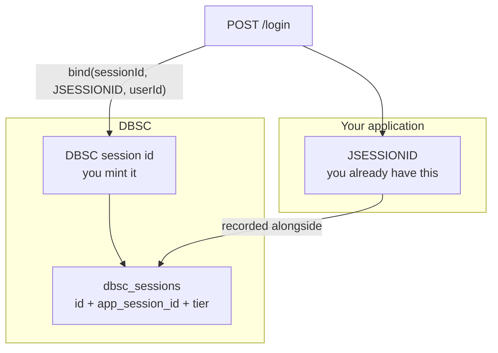

The two are **not coupled by the library**. Nothing reconciles them when your session
expires or your container restarts you into a new `JSESSIONID`; that is what `terminate`
is for, and why the refresh deadline exists as the backstop.

### When the tier moves

The tier is not a per-request decision. It is **stored state** that moves at five specific
moments, and the guard reads the stored value rather than recomputing it — which is what
makes demotion-on-failure possible at all. The lifecycle that drives these moves is in
[The DBSC lifecycle](#the-dbsc-lifecycle-and-where-this-library-differs):

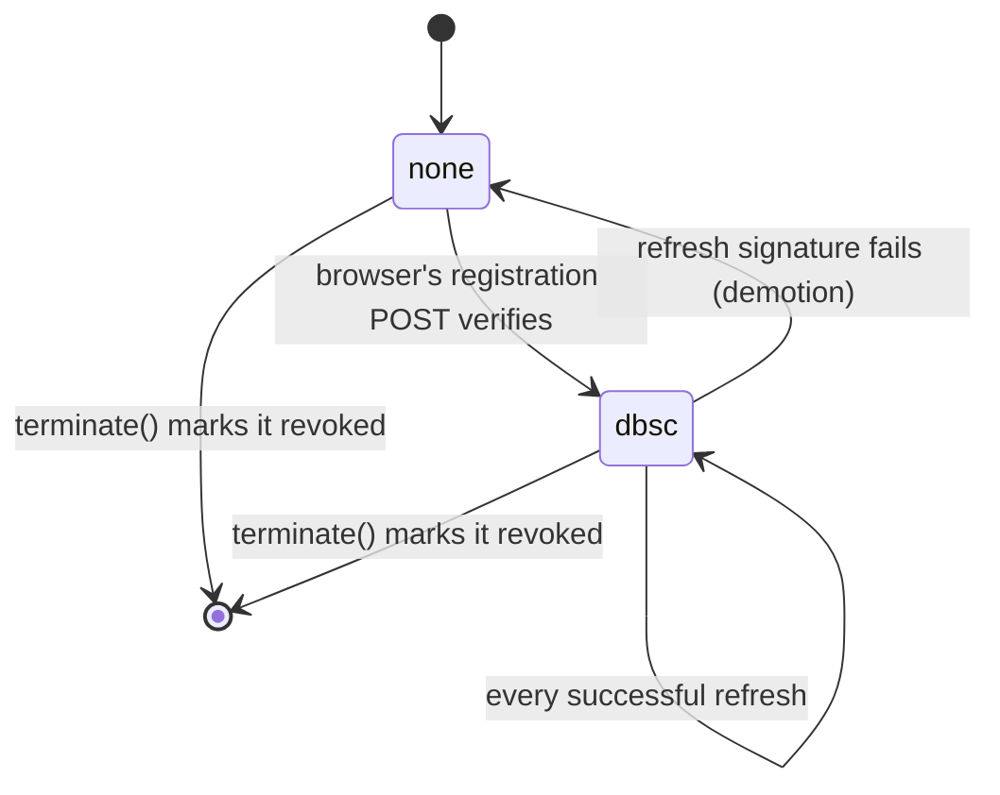

| # | Trigger | Transition | Where |
|---|---|---|---|
| 1 | `bind()` — your login route | *(no change)* starts at `none` | `DbscService.bind` |
| 2 | The browser's `POST /dbsc/regist/<token>` verifies | `none` → `dbsc` | `DbscProtocolEngine.handleRegistration` |
| 3 | A refresh verifies | stays `dbsc`, timestamp moves | `handleRefresh` |
| 4 | A refresh signature fails | `dbsc` → **`none`** | `demoteOnFailure` |
| 5 | `terminate()` on logout | `revoked`, not deleted | `DbscService.terminate` |

`revoked` is a **flag beside the tier, not a tier of its own** — that is why the diagram ends
in a terminal state rather than showing a third tier. The record is marked, never deleted:
a later request still carrying the application's session id has to be recognisable as
"was bound" rather than treated as a first-time visitor, or a logged-out session would
silently fall back to cookie-only access.

The move that matters is #4. Demotion-on-failure is the **security mechanism, not an error
path**: a proof that fails to verify means the caller is not the device that registered, so
the session drops to `none` immediately rather than after some grace period. A replayed
cookie from another machine therefore loses the session on its first attempt. The device
key is deliberately **kept** through the demotion — it has to survive so a later failed
refresh can still be reported as `session_stolen`.

Two consequences follow, and both are deliberate:

- **`bind()` does not make a session protected.** It creates the record at tier `none`. So
there is a window between login and registration in which the tier is `none` and the guard
*allows* — the client is unregistered, not lapsed, and refusing it would lock out every
browser that does not implement DBSC.
- **The tier is a ceiling, not a guarantee.** `effectiveTier` reports `none` for a session
that is expired or explicitly demoted even though its key is still stored. The key decides
how high a session *can* reach; the stored tier decides whether it currently has.

### The DBSC lifecycle, and where this library differs

Everything above describes the state DBSC keeps. This section is the lifecycle that drives
it — the four phases a deployment has to fit into its app — with the **fourth column
marking what this library adds**, because the spec is deliberately silent exactly where a
deployment has to make a choice.

| Phase | The spec's shape | What this library adds | Config |
|---|---|---|---|
| 1. Registration | bind a key to the session | **the session id is yours to mint**, and the path carries a single-use token | `dbsc.registration-token-ttl` (5m) |
| 2. Steady state | refresh before expiry | **a rotating credential ticket** with a grace window | `dbsc.rotation-grace` (60s) |
| 3. Breach | the thief cannot sign | **demotion on the first bad signature**, and the `session_stolen` signal | — |
| 4. Termination | tell the browser to forget | **the record is kept and marked revoked**, not deleted | — |
| *bounding all of it* | *(unspecified)* | **an absolute deadline no refresh can extend** | `dbsc.session-ttl` (1d) |

#### Phase 1: registration — where the session id comes from

The one thing the spec leaves out is *what the session identifier is*. This library makes
it **yours to mint at `bind()`**, and keeps **the id itself** out of every cookie — the
cookie the binding protects carries a rotating ticket instead, never the id:

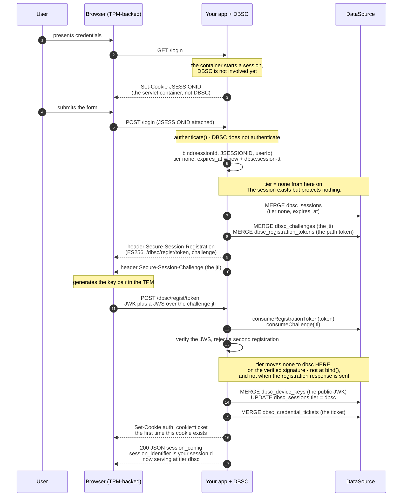

Three things are additions on top of the spec:

- **The session id is the caller's to mint.** `UUID.randomUUID()` is a fine choice. It is
*not* `JSESSIONID` and never appears in a cookie.
- **The registration path carries a token**, not the session id — `/dbsc/regist/<token>`,
single-use, with its own TTL. The spec's flow is agnostic about how the browser is told
where to POST; a fixed path would make the session id itself the only thing naming the
session, which is the value we are trying to keep off the wire.
- **`session_identifier` in the JSON config is the session id itself**, not a cookie name
(spec §9.6 is explicit). Chromium keys its session store on it, so it is the browser's
handle — while the *credential* cookie is a separate, rotating ticket.

(The `DataSource` lane shows the JDBC adapter's tables and H2 `MERGE` syntax — the
`dbsc_*` names created in `JdbcStorageAdapter.initialize()`. Under `storage: redis` or
`in-memory` the same records live elsewhere and no SQL appears.)

Note that **`bind()` alone protects nothing**: the session is created at tier `none` and
only reaches `dbsc` when the registration POST verifies. See
[When the tier moves](#when-the-tier-moves).

**`JSESSIONID` is there before DBSC is.** The container sets it on the first page load:
`GET /login` creates a session before anything is authenticated, which is where Spring
Security keeps the CSRF token. That is the only `Set-Cookie` on the login exchange — the
container does not rotate the session id on login, and DBSC neither sets nor reads it.

**The credential cookie is not set at login.** `bind()` advertises the registration
header, the challenge, and the registration path, but the ticket cookie the binding
protects — `__Host-auth_cookie` by default, named in `credentials[].name` — is first
written on the **registration response**, once the JWKS signature has verified. Until then
the browser holds only `JSESSIONID`, which the container sets and DBSC never touches.
This is deliberate: a ticket minted before the device proved it holds the private key
would name a session no key is bound to yet. (The diagram writes the cookie as
`auth_cookie`; the configured name is `__Host-auth_cookie`, shown in full here because
mermaid cannot lex a leading double underscore.)

#### Phase 2: steady state — a rotating ticket, and a clock on it

The spec tells the browser to refresh before the credential expires. What it does not say
is what the credentialed cookie *contains* — and this is where the deployment gets to put
a clock on a captured cookie:

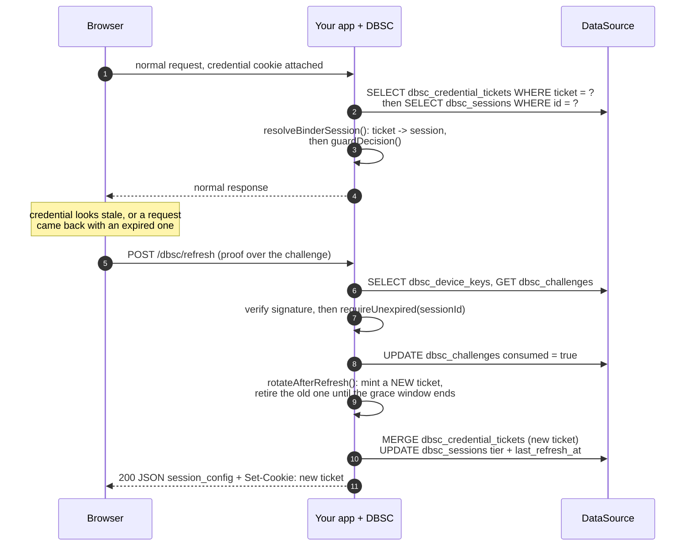

- **The credential cookie holds a rotating ticket, not the session id.** Every refresh
mints a new one; the value it replaces keeps resolving for `dbsc.rotation-grace` (60s
default) because a tab that has not read the new value yet is the normal case. That grace
is what puts a **hard clock** on a stolen cookie: it stops working minutes later, whatever
the thief does. This is the mitigation in Phase 3, made concrete.
- **`dbsc.session-ttl` caps the whole thing** (`1d` default). The deadline is **absolute,
not sliding** — a valid proof past it is refused, and the record is deliberately **not
rewritten**, because rewriting it would extend the deadline and renew the binding forever:

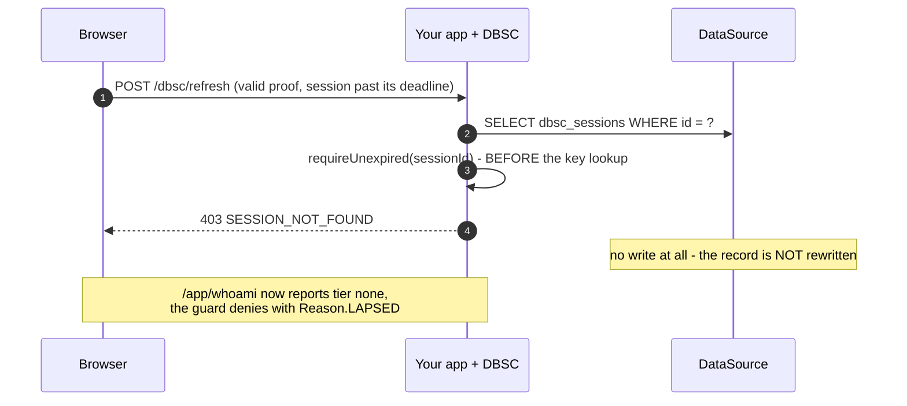

The expiry check deliberately reuses **the same code and the same message** as a session
that never existed. A distinct code would be an oracle for which session ids are real.

#### Phase 3: a stolen cookie — what the library adds to the defense

The spec's answer to theft is that the thief cannot sign. That is true but incomplete: it
tells you *that* a proof failed, not whether the real device is still out there, and it
leaves the session alive until the attacker gives up. This library's addition is what
happens on the **first** bad signature:

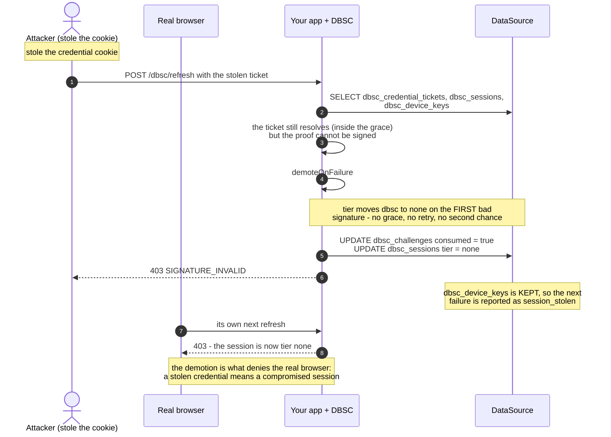

**Demotion is the security mechanism, not an error path.** The session drops to `none`
immediately rather than after a grace period, so a replayed cookie loses the session on
its first attempt. The device key is deliberately **kept** through the demotion — it has to
survive so a later failed refresh can still be reported as the `session_stolen` signal.

The honest cost, shown in the diagram: **the legitimate session dies with it.** There is no
"the real device wins" branch, because the server cannot tell which of two callers holding
the same ticket is the real one. The trade is deliberate — a stolen credential means the
session is compromised, and the safe answer is for both sides to re-authenticate.

#### Phase 4: termination — revoke, and keep the record

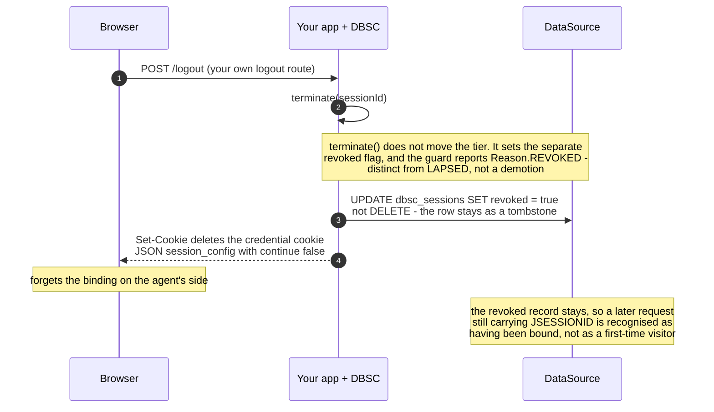

`"continue": false` in the config is what tells the browser to forget the binding
immediately rather than waiting the cookie out; discarding the key pair is the user agent's
side of that and deliberately not something the server can verify. The spec's own Phase 4
assumes the server drops the key association; this library keeps it as a tombstone instead,
which is why `terminate` is **required at logout** rather than optional cleanup.

The addition is **revoke, do not delete**. Deleting the row would make the next request
that still carries the application's session id look like a client that never bound — so a
logged-out session would silently fall back to cookie-only access. With the record kept,
`guardDecision` denies with `Reason.REVOKED` instead.

## Wiring it into your own app

### 1. Get the auto-configuration on the classpath

The library ships `META-INF/spring/org.springframework.boot.autoconfigure.AutoConfiguration.imports`,
so a normal Boot app picks up `DbscAutoConfiguration` with no extra annotation —
just depend on the JAR.

If you disable Boot's auto-configuration, or want the wiring visible, import it
explicitly:

```java
@SpringBootApplication
@Import(DbscAutoConfiguration.class)
public class MyApplication { ... }
```

The auto-configuration applies whenever the JAR is on the classpath. There is no
enable/disable switch on the library itself — the way to turn DBSC off is to take
the dependency out, since a half-installed filter chain that starts but does not
work is a worse failure mode than an absent one.

### 2. Bind a session from your login route

DBSC does not authenticate. It **binds a session that already exists**, so the call goes
at the end of your existing login handler — see
[The application API](#the-application-api) for what `bind()` does and why the call is
required: the id you pass is the DBSC session id, which you mint, and your application's
own session id goes alongside it so the guard can find the binding later:

```java
@PostMapping("/login")
public Session login(HttpServletRequest request, HttpServletResponse response) {
    Session session = authenticate(request);       // your own auth
    dbsc.bind(UUID.randomUUID().toString(), request.getSession().getId(),
              session.userId(), request, response);
    return session;
}
```

On logout, call `dbsc.terminate(...)` so the browser forgets the binding immediately
instead of retrying against a dead session. The record is **kept and marked revoked**, not
deleted: that is what lets a later request from the same session still be recognised as
"was bound" rather than treated as a first-time visitor:

```java
@PostMapping("/logout")
public void logout(HttpServletRequest request, HttpServletResponse response) {
    dbsc.sessionFor(request).ifPresent(s -> dbsc.terminate(s.id(), request, response));
    invalidateYourOwnSession(request);
}
```

### 3. Act on the tier

Your authorization does not change. DBSC is additional state your own code consults, and
nothing is guarded until you say so: declare `DbscGuardRoutes` and `dbscGuardFilter`
enforces the tier where it matches, or read the tier inline. Both forms are in
[Act on the tier](#act-on-the-tier).

## How it is wired (and why)

DBSC is implemented as **`OncePerRequestFilter`s** rather than controllers, and they run
inside the Spring Security chain because that is where your application decides what is
reachable:

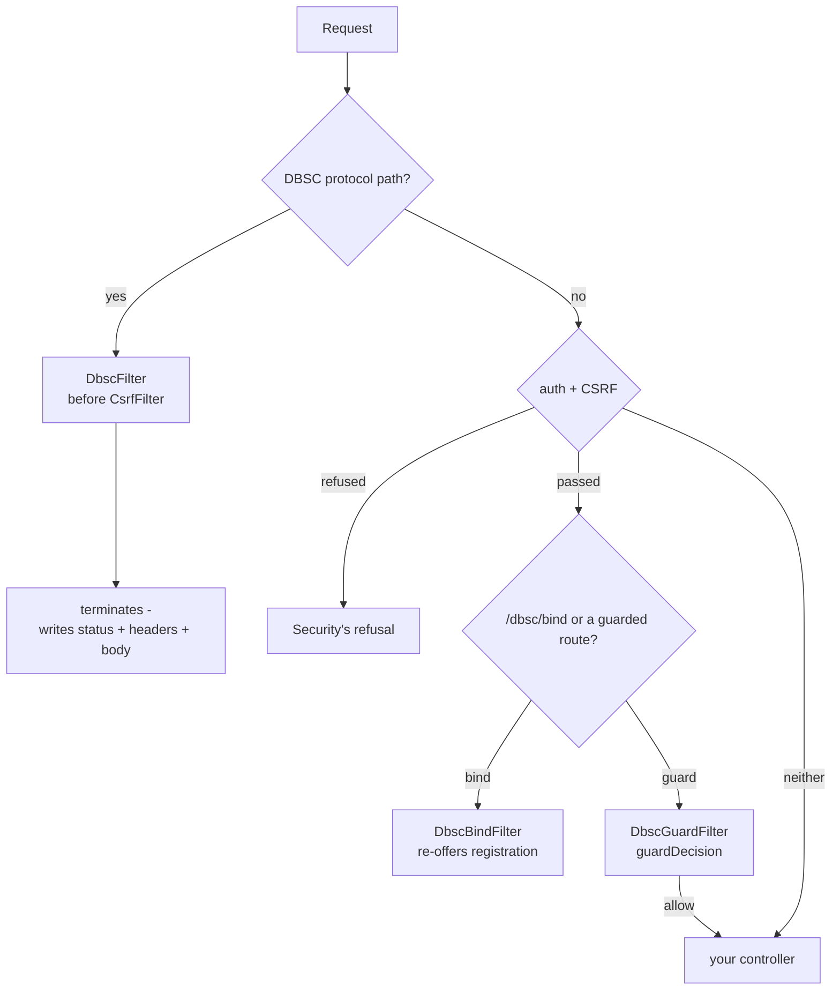

Each branch is independent. The protocol paths are served and stop there; a re-offer or a
guarded route has to pass the application's own checks first; everything else is your
application's chain, unchanged. Gating a single endpoint inline is equally valid — see
[Act on the tier](#act-on-the-tier).

The reasons for filters rather than controllers:

- **These are a protocol surface, not endpoints.** The protocol routes must be reachable
  before any application session exists, and must answer with DBSC's own status
  contract. A filter that terminates the chain enforces that structurally: the
  routes cannot be re-mapped, shadowed by a peer controller, or re-secured.
- **403 vs 401 is load-bearing, and only a filter can guarantee it.** Chromium
  treats a 401 on the refresh route as fatal and terminates the session, so DBSC
  must answer 403. If Spring Security handled these paths itself it would answer
  401 first. `DbscFilter` is registered *before* Spring Security's CSRF filter — the
  earliest anchor that is still a Security filter — so nothing upstream can reject the
  browser's registration POST or replace that status.
- **`/dbsc/bind` is deliberately not a protocol route.** It names its session from your
  own cookie and changes state, so it belongs on your chain behind your authentication
  and CSRF, where a terminating filter cannot pre-empt those checks. That is
  `DbscBindFilter`.
- **It owns no state the application needs to configure.** The filters are handed the
  protocol surface, the bind path and the list of guarded paths, so they add no ordering
  constraints to your chain beyond the two above and no policy of its own over your
  routes.

### Using your own `SecurityFilterChain`

That is the only way to use the library — [Getting Started](#getting-started) is the
full worked example, and the two chains there are the shape to copy. The details worth
restating here, because each one fails silently:

- **The protocol paths belong in a chain with CSRF disabled**, and that matcher must
  **not** be a bare `/dbsc/**`. The browser's registration POST carries no CSRF token, so
  a chain that applies CSRF to it rejects it with `403` before `DbscFilter` ever runs —
  and the status looks like a DBSC refusal. A bare `/dbsc/**` additionally swallows
  `/dbsc/bind`, so authentication and CSRF never run on the one route that needs them.
- **`dbscFilter` goes before `CsrfFilter`**, not merely before authentication.
  Anything `addFilterBefore` anchors on is still ordered *after* CSRF, so the
  registration POST would be rejected first.
- **`dbscBindFilter` goes in the application chain, after CSRF.** It terminates the
  request, so anything that could refuse the request has to have run already.
- **`dbscGuardFilter` goes in the application chain, after authentication.** It asks
  whether an existing session is protected; running it before authentication would
  make it answer questions about a session that has not been established yet.
- **Each filter goes in exactly one chain.** `OncePerRequestFilter` records itself in a
  request attribute, so the same instance in a second chain is skipped without a word.

### Replace the collaborators you have opinions about

`DbscAutoConfiguration` backs off with `@ConditionalOnMissingBean` on every
bean, so defining your own replaces the default. The ones most worth replacing:

| Bean | Default | Replace when |
|---|---|---|
| `StorageAdapter` | JDBC when a `DataSource` is present, else in-memory | You already have a key/session store — implement the interface. The hard requirements are an **atomic** `consumeChallenge`, and `getSessionByAppSessionId` honouring the one-binding-per-application-session rule (the guard relies on it to spot an omitted cookie) |
| `CookieScope` | Resolved from `secure` / `cookie-scope` / `cookie-domain` | You build cookie names or attributes yourself |
| `ChallengeService`, `DbscProtocolEngine`, `TelemetryPublisher` | Library defaults | You need different challenge or telemetry behaviour |
| `Clock` | `Clock.systemUTC()` | You need to freeze time. Override the bean **named `dbscClock`** (`@ConditionalOnMissingBean(name = "dbscClock")`) |

```java
@Bean
StorageAdapter dbscStorage(StringRedisTemplate redis) {
    return new RedisStorageAdapter(redis);   // consumeChallenge is atomic via Lua
}
```

`DbscService` itself is also `@ConditionalOnMissingBean`, but it is a plain
facade — wrapping or replacing it is rarely worth it.

## The application API

Three calls are the whole integration surface. The examples above show where they go;
this is what they do.

| Call | When |
|---|---|
| `dbsc.bind(sessionId, appSessionId, userId, request, response)` | From an authenticated request, usually at the end of your login flow. `sessionId` is the **DBSC** session id, which you mint; `appSessionId` is your application's own session id |
| `dbsc.terminate(sessionId, request, response)` | On logout, so the browser forgets the binding instead of retrying against a dead session |
| `dbsc.sessionFor(request)` / `dbsc.tierFor(sessionId)` | Whenever your own code wants to know whether this browser is bound |
| `dbsc.guardDecision(request, appSessionId)` | When you want the guard's decision without the filter, e.g. to branch on *why* a request was refused |
| `DbscGuardRoutes.of(matchers…)` | To have the filter enforce the tier where the matchers apply |

**The two ids are different concepts and the library never conflates them.** `sessionId`
identifies the DBSC session and the stored device key; `appSessionId` identifies *your*
session, and it is only recorded so the guard can spot a request that dropped its DBSC
cookies. Nothing requires them to match, and nothing derives one from the other:

```
JSESSIONID=72234F6E…               your session   -> appSessionId
__Host-auth_cookie=0Jp36T8T…       the credential -> a rotating ticket
```

`session_identifier` is a different thing again: it is the DBSC session id, sent so
Chromium can key its own session store by it. It names no cookie, so the id stays out of
the cookie jar entirely, and the only cookie that travels is the credential one — named in
`credentials[]`, its value replaced on every refresh. See
[Credential rotation](#credential-rotation).

Mint the DBSC id however you like — a UUID is the obvious choice — and pass your own
session id alongside it. The id is never handed to the browser, so `sessionFor(request)`
is the way to read it back rather than any cookie value.

**`bind()` is the only thing that starts a binding.** It persists the session record,
mints a single-use registration token, stores a challenge and adds
`Secure-Session-Registration` naming `/dbsc/regist/<token>` plus a
`Secure-Session-Challenge` header carrying the JTI to sign; Chromium then calls that
route on its own within about a second, with no client code to write. `DbscFilter` never
adds that header to your application's own responses, so a login flow that never calls
`bind()` produces no binding at all.

There are three cookie lines and a repeated-header rule, and the two are easy to
conflate:

- **`Set-Cookie` repeats.** One response can carry `JSESSIONID` (the container) and the
credential cookie (this library) as two separate `Set-Cookie` headers, so read
*all* of them rather than the last. A dict that keeps one per name will show only one.
- **The credential cookie is set on the registration response, not by `bind()`.** Up to
and including the login response, the only cookie on the wire is `JSESSIONID`. The
ticket is written once the JWKS signature verifies.

**The lifetime is configuration, not an argument.** `bind()` stamps
`expiresAt = now + dbsc.session-ttl`, and that deadline is **absolute**: a successful
refresh does not move it, so a device that keeps proving possession still loses the
binding once it passes. There is no `ttlMillis` parameter, because a deployment has one
answer to "how long may a binding live" and a caller that could pass a different value is
the one most likely to get it wrong.

Past the deadline the binding is treated as **absent**, not as unproven: a refresh is
refused with the same `SESSION_NOT_FOUND` an unknown session id gets — same code, same
message — the guard refuses the session, and `tierFor` reads `none`. Reusing one code for
both keeps the unauthenticated refresh route from answering "this id once existed".

**What the deadline does not govern.** It bounds the binding, not your session: a browser
holding a valid `JSESSIONID` keeps sending it, and this library does not invalidate it.
Expiring the binding therefore removes the *proof*, not the login — if a binding that
outlives its deadline should also end the session, that is your logout to call, from
`sessionFor(request)` in a routine the application already has.

The call is cheap but not free — one challenge and one cookie write — so a route that
binds on every request is fine, and keeping it off hot paths is better. It is **not**
idempotent: each call writes a record, and a second call under the same `sessionId`
replaces the first. That is deliberate, so a re-login can re-key an existing session — and
it also restarts the clock, since the new record carries a new deadline.

### Act on the tier

Two ways to enforce it, and they check the same thing. **Declaring a matcher** hands the
decision to `DbscGuardFilter`, which refuses with `403` and `DBSC_REQUIRED` before your
handler runs. Patterns are ordinary Spring Security matchers, so the same
`/api/**` you would write in `authorizeHttpRequests` works here:

```java
@Bean
DbscGuardRoutes dbscGuardRoutes() {
    return DbscGuardRoutes.of(
            new AntPathRequestMatcher("/api/**"),
            new AntPathRequestMatcher("/account/**"));
}
```

Several matchers are OR-ed, and `DbscGuardRoutes` is itself a `RequestMatcher`, so it
composes with `AndRequestMatcher` and friends. A matcher is only the **range** — what
happens inside it is the policy below.

**Reading the tier inline** is for a route where a blanket refusal is the wrong answer —
where the response should differ, or where only part of the handler needs protection:

```java
@PostMapping("/api/transfer")
public ResponseEntity<?> transfer(@RequestBody Transfer body, HttpServletRequest request) {
    Optional<Session> session = dbsc.sessionFor(request);
    if (session.isEmpty() || dbsc.tierFor(session.get().id()) != ProtectionTier.DBSC) {
        // Signed in, but this browser is not proving possession of a bound key.
        return ResponseEntity.status(HttpStatus.FORBIDDEN).body(stepUpOrReauthenticate());
    }
    return transferService.execute(body);
}
```

#### What the guard actually decides

The tier check above is necessary but not sufficient, because "tier is `none`" covers two
situations that must be answered differently:

| Situation | Decision |
|---|---|
| Registered, currently proving possession | allow |
| Registered once, then demoted (or revoked) | **refuse** |
| Bound, but the record is gone | **refuse** — it was bound and is not any more |
| Bound, but the deadline has passed | **refuse** — the binding is read as absent, so this is the row above |
| `bind()` ran, registration has not completed yet | allow (or refuse under `dbsc.unregistered: deny`) |
| No DBSC cookie, and no binding for this application session | allow (or refuse under `dbsc.unregistered: deny`) |
| No DBSC cookie, but a binding exists for this application session | **refuse** |

The two rows marked `dbsc.unregistered` are the one **policy** choice in the table, and
they are what `DbscService.Unregistered` in `DbscProperties` controls:

| `dbsc.unregistered` | Meaning |
|---|---|
| `allow` (default) | DBSC is an **additional layer**. A browser without support for the protocol, and a client that has logged in but not yet registered, both reach the application. A session that bound and then lapsed is still refused. |
| `deny` | DBSC is a **requirement**. Any client that has not registered is refused with `403 DBSC_REQUIRED`, so browsers without support are locked out. Only appropriate when the client population is known to be capable. |

The distinction matters when choosing a matcher: under `allow` a matcher covering `/**`
does not lock anyone out, and still catches every lapsed session. Under `deny` the same
matcher is a hard requirement on every route.

`DbscGuardFilter` therefore delegates to `dbsc.guardDecision(request, appSessionId)`
rather than comparing tiers itself. Use the same call if you want to branch on the reason
(`GuardDecision.Reason` tells you which row above applied) instead of getting a flat
`403`.

The last two rows are the point. **Dropping the DBSC cookies is something the client
controls**, so "no cookie" must not be read as "no binding" — otherwise a stolen
`JSESSIONID` could regain unbound access just by not presenting the cookie it stole. That
is why `bind()` records your application's session id, and why the guard reads it:
without it, a first-time visitor and a client that deliberately omitted its cookies are
indistinguishable.

Both forms make the same decision, so these hold for either:

- **It is a step-up decision, not an authentication one.** A `dbsc` tier never
  substitutes for being authenticated; read it *in addition to* your own checks, as
  above. That is also why the guard lives in the application chain rather than the
  protocol one, and why its refusal is a `403` with `DBSC_REQUIRED` rather than a
  `401` — a `401` reads as signed out, and Chromium treats one on the refresh route
  as fatal.
- **The tier is the live answer, not the value on the record.** It accounts for the
  refresh cadence, the grace window and the binding's absolute lifetime, so a session
  whose browser has stopped refreshing reads `none` — which is the demotion you are
  actually trying to surface. A session with a perfectly good registered key reads `none`
  too, once it has lapsed or once `dbsc.session-ttl` has passed.
- **An unregistered client is allowed through, by design.** A browser without DBSC
  support (or a user who has just logged in, before registration completes) is
  legitimately unbound. This is what lets one application serve both populations:
  DBSC-capable clients get the binding enforced, everyone else runs on the plain
  session as before. Deciding that a browser which *cannot* do DBSC is refused is a
  policy choice the library deliberately does not make for you.

If your application cannot act on a weaker tier — for example a compliance rule that
says a stolen cookie must never be usable — say so explicitly rather than assuming the
handshake alone covers it: the protocol routes and `bind()` are what the library does,
and it is the guard or a check like the block above that turns a bound session into an
enforced one.

### Riding alongside your own session

The two extensions above are not in the DBSC spec, and they are what make the library a
*fallback* layer rather than an either/or choice — one application can serve
DBSC-capable browsers and ordinary ones at the same time.

**Your session cookie is used in parallel, not replaced.** The DBSC session id and your
application's session id are bound together at `bind()`, and the guard can therefore
answer a question the protocol itself cannot: was *this* session ever bound? Because the
application session id is treated as an opaque string rather than as a container-managed
value, this composes with Spring Session as well as with a plain `HttpSession`.

| Present on the request | Binding exists for the app session? | Decision |
|---|---|---|
| DBSC credential cookie | — | the credential decides; tier and revocation are read from it |
| none | yes | **refused** — the client dropped its DBSC cookies |
| none | no | unregistered: allowed, or refused under `dbsc.unregistered: deny` |

The middle row is the one worth reading twice. "No DBSC cookie" cannot be read as "no
binding", because *omitting* a cookie is something the client controls: otherwise a
stolen `JSESSIONID` would regain plain-cookie access simply by not presenting the
credential cookie. At most one binding per application session id is enforced, so this
lookup has a single answer rather than a picking problem.

The application's session id reaches the guard from `request.getSession(false)` —
deliberately the servlet session rather than the authenticated principal, since it must
be the same value the login route passed to `bind()`. A request with no session has no id
to look up and reads as unregistered. Call `dbsc.guardDecision(request, appSessionId)`
directly if you resolve that id some other way.

## Configuration

All keys are prefixed `dbsc`. Defaults match the toolkit spec.

| Key | Default | Notes |
|---|---|---|
| `secure` | `true` | `__Host-` cookies + `Secure`. **Turn off only for localhost HTTP** |
| `unregistered` | `allow` | What the guard does with a client that has no DBSC binding: `allow` (additive) or `deny` (required) |
| `cookie-scope` | `host` | `site` enables multi-subdomain and requires `cookie-domain` |
| `cookie-domain` | — | e.g. `example.com`; required for `site` scope |
| `registration-path` | `/dbsc/regist` | **prefix** for the registration route, not a full path: the advertised route is `<prefix>/<token>` |
| `refresh-path` | `/dbsc/refresh` | also the `refresh_url` in the JSON config |
| `bind-path` | `/dbsc/bind` | the re-offer route for a client that manages its own key. See [Soft DBSC](#soft-dbsc-the-fallback-for-browsers-without-native-support) |
| `soft.enabled` | `true` | registers `POST /dbsc/bind` and the Soft DBSC fallback. Off means the route is a 404. See [Soft DBSC](#soft-dbsc-the-fallback-for-browsers-without-native-support) |
| `session-identifier-name` | — | **removed.** `session_identifier` carries the session id itself (spec §9.6), so there was no name left to configure. Setting it now has no effect |
| `credential-cookie-name` | `__Host-auth_cookie` | the protected cookie named in `credentials[].name`, whose value rotates. Used verbatim — a prefix is your choice |
| `cookie-path` | `/` | `Path` of the credential cookie. Must start with `/`: the same string is advertised in `credentials[].attributes` and Chromium compares it byte-for-byte with the real `Set-Cookie`, and a relative path is one the browser rewrites. It must also cover the registration route, or the registration POST cannot present the credential |
| `cookie-http-only` | `true` | `HttpOnly` on the credential cookie. Turning it off hands the credential to page script — the one thing the flag exists to prevent. Soft DBSC does not need it off: the worker never reads the cookie either |
| `cookie-same-site` | `LAX` | `SameSite` (`LAX`/`STRICT`/`NONE`). `NONE` requires `secure: true`, and is what a genuinely cross-site flow needs |
| `binding-cookie-ttl` | `10m` | lifetime of the credential cookie, and the window after which an unrefreshed session demotes. Also the refresh cadence the browser settles into |
| `registration-token-ttl` | `5m` | lifetime of the single-use registration token. The token is spent by the registration attempt, success or failure; this only bounds one that is never presented at all |
| `challenge-ttl` | `5m` | lifetime of a challenge JTI |
| `refresh-grace` | `30s` | softens the freshness poll across a refresh |
| `rotation-grace` | `60s` | how long a retired credential cookie value keeps resolving. Rotation itself is not optional — see [Credential rotation](#credential-rotation) |
| `session-ttl` | `1d` | the binding's **absolute** lifetime. `bind()` stamps the deadline as now + this value and a refresh never moves it, so a device that keeps proving possession still loses the binding when the deadline passes. Configured here rather than passed to `bind()` because a deployment has one answer to "how long may a binding live". It bounds the DBSC binding only — it does not govern your `JSESSIONID`, which the browser re-sends as long as it lives. Set it to your own session lifetime or shorter, never longer |
| `scope-origin` | *derived from the request* | pins `scope.origin`. Set only when the derived value is wrong — a proxy rewriting the host to an internal name. Validated at startup; a wrong value makes Chromium discard the session while the server still answers 200 |
| `scope-specifications` | `[]` | rules written into `scope.scope_specification`. See [Session scope](#session-scope) |
| `allowed-refresh-initiators` | `[]` | hosts outside the scope that may still trigger a refresh. Empty means none — see [Session scope](#session-scope) |
| `storage` | `jdbc` when a `DataSource` is present | `memory` for tests and local dev only; `redis` for a host already running Redis/Valkey with no `DataSource` |
| `trust-forwarded-headers` | `false` | believe `X-Forwarded-For` / `X-Forwarded-Proto`. Leave off unless a reverse proxy is known to overwrite them — they drive the `scope.origin` written into the JSON config |

### Credential rotation

One cookie is in play, and this is the important part to get right:

| Cookie | Its name appears in | Its value | Set by this library? |
|---|---|---|---|
| `__Host-auth_cookie` | `credentials[].name` | a credential ticket | **yes** — replaced on every successful refresh |

Per spec §9.6 `session_identifier` is "the identifier for the newly created session" —
the session id **itself**, not the name of a cookie holding it. Chromium keys its session
store by this value (§8.1 Identify session) and echoes it back in `Sec-Secure-Session-Id`
on every refresh (§9.4), so the server resolves the session by exactly this string. It is
therefore whatever you passed to `bind()`, and it never changes for the life of the
binding — rotating it would orphan the registration.

The id is still **not a cookie**: nothing is read from or written to a cookie of that
name, and `credentials[]` names a different cookie entirely. So there is no long-lived
value in the cookie jar to lift, and the refresh path needs no cookie to agree with.

The `dbsc.session-identifier-name` property is **gone**, not deprecated: it now has no
reader. It dated from an earlier reading of §9.6 in which this field held a fixed key
name; that was wrong, and the field is the id. A configuration file that still sets it
will not fail to start — Spring ignores unknown keys — so remove it yourself.

Every successful refresh mints a new credential ticket and hands it back in the
`Set-Cookie` of the `credentials[]` cookie. This is not optional: that cookie can be
copied, and a copy is only ever worth as little as the value's remaining life. Making it a
setting would mean the safe behaviour is the one you have to know to ask for.

The one tunable is the grace:

```yaml
dbsc:
  rotation-grace: 60s
```

**What it does not do.** It does **not** make the session proof-free, and it does not
invalidate a key. A refresh *is* the browser's proof of possession, so whoever holds the
cookie and the device still refreshes successfully — the server cannot tell a stolen
cookie from the real browser. What rotation buys is narrower and worth stating plainly: a
captured credential cookie stops resolving `rotation-grace` after the real browser's next
refresh, instead of staying valid for the session's whole lifetime. What stops a stolen
*key* is `terminate()` and the demote-on-failure path, and neither is a substitute for
treating a leaked binding as everything it is worth.

**How the grace works, and why it has to exist.** The browser only learns the new ticket
from the refresh *response*, so any request already in flight — a second tab, a retry, a
slow proxy — still carries the old one. For `grace`, the retired ticket keeps resolving to
the same session. Without that, a second tab's refresh would be refused, and Chromium
records a refresh failure as permanent and will not retry, which would silently kill DBSC
for the whole browser.

The grace is the exposure. It is the window in which a stolen credential still works, so
set it to the longest gap between refresh attempts you need to survive, not to a round
number:

| `grace` | Behaviour |
|---|---|
| short (a few seconds) | Less exposure, but a slow tab or an idle one that wakes up late gets refused and has to re-register |
| `60s` (default) | Survives a normal multi-tab refresh race |
| long (minutes) | The rotation buys much less than it costs — the retired ticket outlives the reason to retire it |

A retired ticket used *within* the grace is answered normally and rotated again, so a
lagging tab cannot pin the old value — each successful refresh moves the credential
forward while the session id stays put.

**Cost.** One extra record write and one expired-row sweep per refresh, plus a row (or a
key) per retired ticket held for the grace. Rotation happens only after the signature
verifies, so an unauthenticated request can never retire anything: minting the new value
first would be a denial-of-service primitive that needs no key at all.

### Session scope

Three keys tell the browser where the session applies and who may make it refresh. All
three are **advisory**: the user agent enforces them, and this server never consults them
when handling a request. That means a mistake here does not produce a server-side error —
it produces a browser that quietly applies the session somewhere you did not intend.

```yaml
dbsc:
  cookie-scope: site
  cookie-domain: example.com

  # Which URLs are in scope: walked in REVERSE, first match wins.
  scope-specifications:
    - type: exclude
      domain: "*.example.com"
      path: /static
    - type: include
      domain: trusted.example.com
      path: /only_trusted_path

  # Hosts OUTSIDE the scope that may still trigger a refresh.
  allowed-refresh-initiators:
    - example.com
    - "*.example.com"
```

**`include_site` is set by `cookie-scope`, not by its own key.** `host` (the default)
means the origin only; `site` means the whole registrable domain. Scope is decided in the
same place the cookie is, so the credential and the scope can never disagree. Note that
`include_site: true` takes precedence over every rule in `scope_specification` (§8.2):
the domain check happens first, so an `exclude` rule cannot narrow a site-scoped session
back to a single host.

**`scope_specification` rules are applied in reverse.** §8.2 walks the list from last to
first and stops at the first match, which makes the natural spelling outermost-first: put
the broad `exclude` first and the narrower `include` after it, as above. Order is
preserved exactly as written for this reason; re-ordering the array inverts the meaning.

Each rule has three keys, all of which are written out even when you omit them:

| Key | Default when omitted | Meaning |
|---|---|---|
| `type` | — (required) | `include` adds the match to the scope, `exclude` removes it |
| `domain` | `*` | `*` matches every host; `*.example.com` matches subdomains but **not** `example.com` itself; a bare host matches only itself |
| `path` | `/` | Matches when the URL path is exactly this, starts with it followed by `/`, or — when the pattern ends in `/` — starts with it |

**`allowed_refresh_initiators` closes a timing side channel.** By default an out-of-scope
request can trigger a refresh, and the refresh is slow: the browser has to reach the
hardware key before it can continue. A cross-origin page that fetches a protected endpoint
therefore learns whether the user is logged in from the delay alone, with no error and no
response body. Listing the embedding or calling hosts here confines that to the ones you
chose; every other initiator gets no refresh, so there is nothing to time. In-scope
requests are always allowed (§8.3), so the list concerns out-of-scope callers only.

Both lists default to empty, which means "the whole origin (or site)" and "no out-of-scope
initiator" respectively. Both are also the spec's own defaults — an empty
`allowed_refresh_initiators` is what a browser assumes when the key is absent.

**Pinning `scope.origin`.** `scope.origin` is normally derived from the request, which is
the only value that can be right for every deployment. Set `dbsc.scope-origin` only when
that derivation is known to be wrong:

```yaml
dbsc:
  scope-origin: https://example.com:8443
```

Prefer `trust-forwarded-headers: true` where that applies: it stays correct if the public
name changes, whereas a pinned origin has to be updated by hand. The value must be an
absolute origin with no path (`https://example.com`, not `https://example.com/app`), and
it is validated at startup — because on the wire a mismatch is invisible. §8.9 requires
`origin` to be same-site with the destination and terminates the session on a mismatch,
and it does so **in the browser**: the server still answers 200 and logs nothing, while
the session silently fails to exist. Failing the context start is the only way that
mistake is ever visible.

### Storage

Three stores, chosen by `dbsc.storage`. The property decides, never the classpath: an
application that happens to have both a `DataSource` and a Redis client is never in
doubt about which one DBSC uses.

| Value | Store | Use when |
|---|---|---|
| `jdbc` | `JdbcStorageAdapter`, on your `DataSource` | Default. Your state already lives in a database |
| `redis` | `RedisStorageAdapter`, on `StringRedisTemplate` | You already run Redis, Valkey, KeyDB, Dragonfly or ElastiCache and have no `DataSource` |
| `memory` | `InMemoryStorageAdapter` | Tests and local dev. **Not for production** — every restart breaks live sessions, because the browser still holds a cookie for a key the server no longer remembers |

```yaml
dbsc:
  storage: jdbc          # or: redis, memory
  secure: true
  cookie-scope: site
  cookie-domain: example.com
```

With a `DataSource` on the classpath, sessions, keys and challenges all live in the
database (`dbsc.storage: jdbc`).

Every store has to satisfy the same two hard requirements, which are worth restating
because both are easy to get wrong in a way that only shows up as a security bug:

- `consumeChallenge` and `consumeRegistrationToken` must be **atomic**. Two concurrent
  refresh attempts on one challenge MUST yield exactly one `true`; a read followed by a
  separate write lets an attacker race a captured proof against the legitimate client
  and have both accepted.
- `getSessionByAppSessionId` must honour **one binding per application session id**.
  The guard relies on it to tell a browser that never registered from one that
  registered and then dropped its cookies.

#### Redis (and Valkey)

The adapter talks to anything speaking RESP, so Valkey needs no separate adapter — the
protocol is the same, and so are the commands it uses.

**Why it exists.** Sessions, device keys, challenges and registration tokens are all
small values with an expiry, which is what a Redis-compatible server is good at. If you
already run one and have no database, this is the durable store that does not make you
add one. The property is what decides, never the classpath: an app with both a
`DataSource` and a Redis client is never in doubt about which DBSC uses.

**The dependency is optional.** `spring-data-redis` and `lettuce-core` are declared
`<optional>`, so a host that stores DBSC state in its database does not inherit a Redis
client. A host that sets `dbsc.storage: redis` needs both on the classpath *and*
`spring.data.redis.*` configured; without a `StringRedisTemplate` the context fails at
startup with a message naming the property, rather than at class-load time somewhere
unrelated.

**Keys are not namespaced by tenant.** All keys are prefixed `dbsc:`, so two
applications sharing one server (or one database index) would share sessions. Give each
its own server or its own database index. The key layout is:

| Key | Type | TTL |
|---|---|---|
| `dbsc:session:<id>` | hash | the session's own retention deadline, never past `dbsc.session-ttl` |
| `dbsc:app-session:<appSessionId>` | string | the session's own retention deadline |
| `dbsc:device-key:<sessionId>` | hash | the session's deadline, or 24h when orphaned |
| `dbsc:challenge:<jti>` | hash | the challenge's expiry **+ 1h** |
| `dbsc:registration-token:<token>` | hash | the token's expiry **+ 1h** |
| `dbsc:credential-ticket:<ticket>` | string | the rotation grace, no longer |

A refresh never extends a session key, so the Redis TTL and the binding's absolute
deadline always agree: past `dbsc.session-ttl` the key is gone and the refresh is refused
by the engine, whichever happens first. The `last_refresh_at` on the hash does not push
the deadline forward.

The `+ 1h` on challenges and registration tokens is deliberate: the record has to outlive
its stated expiry, or a client presenting a JTI that lapsed a moment ago would get
`CHALLENGE_NOT_FOUND` where the protocol says `CHALLENGE_EXPIRED`. After that hour the
two answers are equivalent and the key is reclaimed.

Every consume is one Lua script, evaluated server-side:

```lua
if redis.call('EXISTS', KEYS[1]) == 0 then return 0 end
if redis.call('HGET', KEYS[1], 'consumed') == '1' then return 0 end
redis.call('HSET', KEYS[1], 'consumed', '1')
return 1
```

Lua runs to completion without interleaving, so the check and the write are one step and
exactly one concurrent caller can observe `1`. A read-then-write would be a replay
vulnerability: an attacker could race a captured proof against the legitimate client and
have both accepted.

**That atomicity is not covered by the test suite, and cannot be.** `RedisStorageAdapterTest`
runs against a mocked `StringRedisTemplate`, and a stub is happy to accept three
concurrent `consumeChallenge` calls that a real server would resolve to one — it would pass
just as well against the read-then-write implementation the script exists to avoid. The
test pins the surrounding work instead: key layout, field encoding, TTLs, and the direction
of the script's `1`/`0` reply. The concurrency guarantee rests on the script above being
correct, which is why it is quoted here in full rather than described.

#### Schema

The tables are created on startup by `JdbcStorageAdapter.initialize()`, which issues
`CREATE TABLE IF NOT EXISTS` and is safe to run on every boot. A fresh database needs
no setup.

That default is convenient, but in production the schema should be owned by a migration
tool (Flyway, Liquibase, or whatever the application already uses), for two reasons:

- The runtime database user otherwise needs **DDL rights**, which many production
  setups deliberately withhold.
- Schema changes then get reviewed, versioned and rolled out like every other change,
  instead of silently appearing on the first boot of a new release.

The DDL is shipped for exactly that, at
[`src/main/resources/db/migration/V1__dbsc_storage.sql`](./src/main/resources/db/migration/V1__dbsc_storage.sql):

| Table | Contents |
|---|---|
| `dbsc_sessions` | one row per bound session (`id` PK, `app_session_id`, `user_id`, `tier`, `revoked`, timestamps). `app_session_id` is uniquely indexed, so there is at most one binding per application session |
| `dbsc_device_keys` | the registered hardware key it holds — `session_id` PK, so **one key per session** |
| `dbsc_challenges` | outstanding JTIs, with the `consumed` flag that makes consumption atomic |
| `dbsc_credential_tickets` | tickets that still resolve to a session, with their expiry. Written by [credential rotation](#credential-rotation); a row is dropped when it is read after its expiry |

The `dbsc_sessions` table references the DBSC session id (`id`) and your application's
session id (`app_session_id`) as two independent columns — see
[The application API](#the-application-api). Only `id` is a foreign key target;
`app_session_id` exists solely to answer "is there a binding for this application
session?" when a request arrives without DBSC cookies.

The file is a plain `CREATE TABLE IF NOT EXISTS` migration: drop it into your
migration tool's directory, or run its statements however you already run schema
changes. It is **byte-identical** to what `initialize()` issues and both are
idempotent, so there is no conflict either way — applying it and then starting the app
leaves the schema unchanged, and you can adopt it on an existing deployment without a
baseline step.

The SQL is deliberately portable — no vendor-specific types, no sequences — so it works
on PostgreSQL, MySQL, MariaDB, H2 and SQL Server. Timestamps are `BIGINT` epoch
milliseconds throughout, matching how the protocol carries them.

If you would rather not carry the migration at all, `initialize()` is also safe to call
from a schema-management hook — the DDL statements are quoted at the top of
`JdbcStorageAdapter`.

## Clients that manage their own key

Native DBSC keeps the private key somewhere the page cannot reach it — a TPM, a secure
enclave, or at least a browser process boundary. A client that does its own key
management has none of that: the key is a `CryptoKey` it generated, and an XSS on the
origin can ask it to sign. That is a real reduction in what the binding proves, and it
is worth being explicit about before adopting it: **a script-managed key is an oracle,
not a secret.** It still buys something — a cookie stolen from a different device
cannot be replayed, because the thief does not have the key — but it does not survive
compromise of the origin itself.

The library supports such a client with two additions, neither of which changes what
native browsers do.

### Soft DBSC: the fallback for browsers without native support

Everything above describes the wire contract, and any client can implement it. That is
the deliberate shape, but writing one from scratch means getting a lot right: the JWS
shapes, the single-use token, raw `r||s` signatures, and a refresh schedule nothing on
the server will remind you about. **Soft DBSC** is a ready-made implementation of that
contract — `dbsc-soft-sw.js` and the module it imports, `dbsc-soft-client.js`, both at
the repository root — so the only thing left is to load it.

```html
<meta name="csrf" th:content="${_csrf.token}"/>
<meta name="csrf-header" th:content="${_csrf.headerName}"/>

<script src="/dbsc-soft-client.js"></script>
<script>
  // Do not start a worker on a browser that binds natively. Chromium on
  // Windows has the hardware-backed tier, and a worker there would be a
  // `fetch` hook on every request, for a binding that will never happen.
  // Android is not on that list yet: native DBSC has not shipped there, so the
  // fallback is what serves it.
  if (!DbscSoft.expectsNativeDbsc()) {
    const registration = await navigator.serviceWorker.register('/dbsc-soft-sw.js');
    await navigator.serviceWorker.ready;

    const csrf = document.querySelector('meta[name="csrf"]');
    const header = document.querySelector('meta[name="csrf-header"]');
    const worker = registration.active;

    const channel = new MessageChannel();
    channel.port1.onmessage = e => console.log(e.data);   // { phase: "registered", … }
    worker.postMessage(
      { type: 'bind', csrfToken: csrf.content, csrfHeader: header.content },
      [channel.port2]);
  }
</script>
```

`dbsc-soft-client.js` is loaded as a **plain script**, not a module, and that is the
one line that makes the check above possible: `expectsNativeDbsc()` lives in it, and the
page has to be able to ask the question *before* a worker is installed. The two loads
are independent scopes — the page's copy has a `document`, the worker's does not — so
each gets its own `DbscSoft` and neither interferes with the other.

That is the whole integration: skip on native browsers, register the worker, wait for it
controlling the page, hand it the CSRF token, and ask it to bind. From then on the
worker looks after the session on its own.

**Both files are configuration-by-editing.** They are served verbatim — no build step,
no template substitution, no config endpoint — so the values a deployment has to get
right are the constants at the top of each file, and editing them is the intended
mechanism rather than a workaround. Three constants need your attention:

| Where | What to change |
|---|---|
| `dbsc-soft-sw.js` | `BINDING_COOKIE_TTL_MS` must equal `dbsc.binding-cookie-ttl` — see [Telling it how long the cookie lives](#telling-it-how-long-the-cookie-lives) |
| `dbsc-soft-sw.js` | `PROTECTED_PREFIXES` should mirror your `DbscGuardRoutes` — see [What the worker refreshes for](#what-the-worker-refreshes-for) |
| `dbsc-soft-client.js` | `CONFIG.bindPath` / `refreshPath`, the same paths again |

Each of those is marked with an `EDIT THIS BY HAND` comment at the point of edit, so
the instruction travels with the file and not only with this README.

#### The Soft DBSC workflow

This is the part that has no native equivalent. A native browser runs the protocol
itself — the server hands it an offer and it registers, and it refreshes on its own
cadence — so the application never sees any of it. A script client has to be told, and
the exchange is split across two contexts that cannot talk to each other directly: the
**page** (which has a `document`, a CSRF token, and a user who just logged in) and the
**Service Worker** (which sees every request but has no document and no cookie access).

The four diagrams below are the whole of it: the one-time bind, then the two things
the worker does unattended — refresh ahead of the credential cookie expiring, and
refresh on the request that arrives with an already-expired one.

##### 1. Bind: the one exchange the page drives

The page does this **once**, right after login. Everything after this diagram is the
worker's, not the page's.

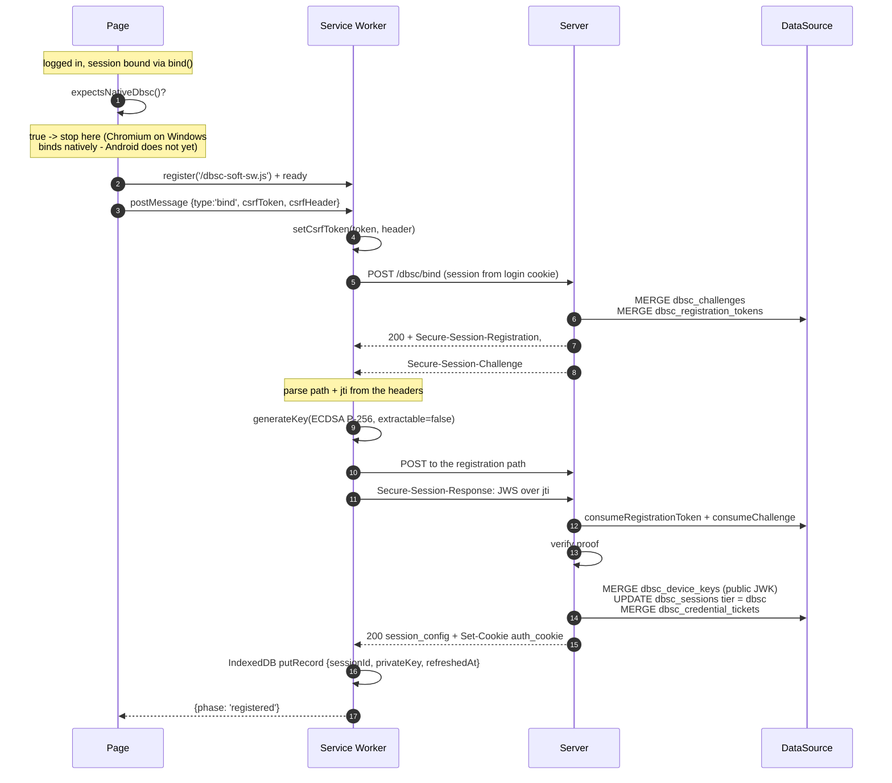

Three things about that exchange are worth naming, because each is a place a
hand-written client usually goes wrong:

- **The route is not the native one.** The offer comes from `POST /dbsc/bind`, not from
the login response. `bind()` writes its offer onto whichever response called it, and a
script can only act once its own code is running — which is arbitrarily later than the
navigation that carried the offer. The re-offer route is the way back to it.
- **The key is generated here and never leaves.** `extractable=false` means the private
key stays a `CryptoKey` handle: this script can sign with it and cannot export it. Only
the public half goes to the server.
- **The response is the server's, not the client's.** `session_identifier` is read out of
`session_config`; the client does not assume the id it will use next.

##### 2. Steady state: the worker refreshes ahead of expiry

This is the specification's *proactive* trigger (§6: "if a session credential will
expire soon, and an in-scope document is active, the user agent can refresh
proactively"). The worker cannot see the credential cookie — it is `HttpOnly`, and a
worker has no cookie jar — so it keeps its own clock from `refreshedAt`, stamped by the
last exchange the server answered.

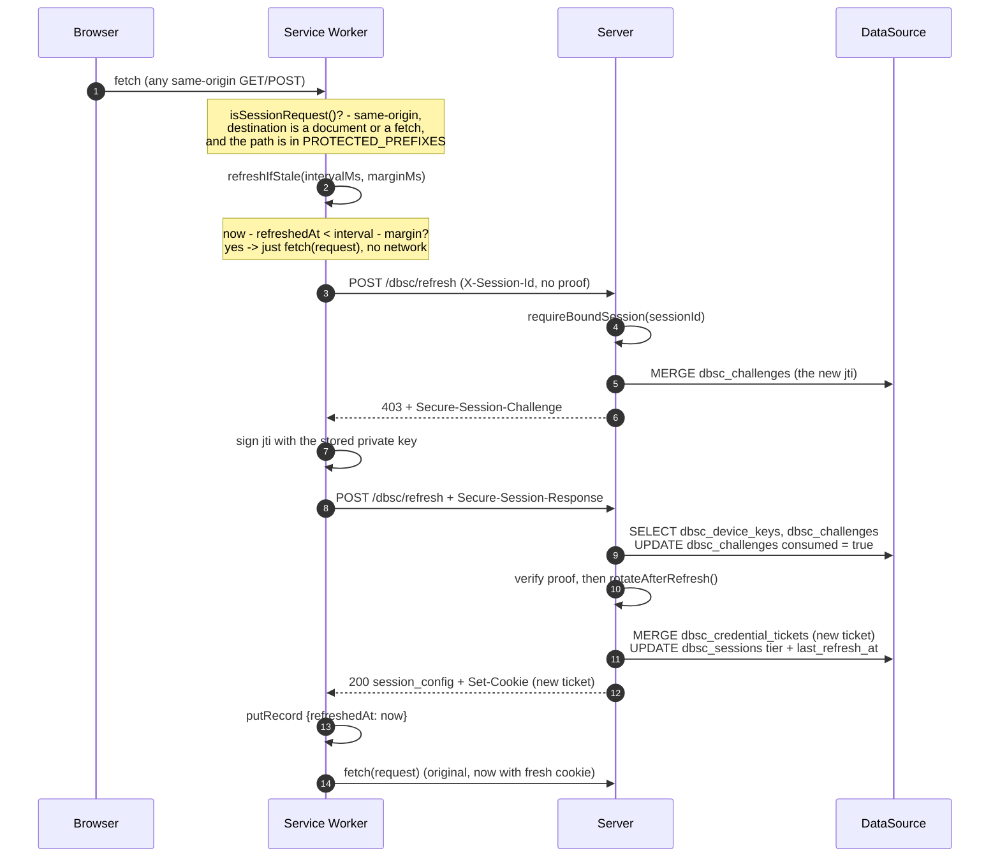

The first leg being a **403** is not a failure — it is how a challenge is issued, and
it is the same shape the native flow uses. A `401` is fatal for a native browser and
this client treats it the same way.

##### 3. The trigger that only a worker can serve

This is the specification's *primary* trigger (§5: "the refresh endpoint is contacted
every time a request is made with an expired bound cookie, and its response blocks the
original request" — emphasis on *blocks*). Nothing but a `fetch` hook can do it, because
nothing else sees a request before it goes to the network.

The difference from diagram 2 is only *why* the refresh fires: there, the client's own
clock said it was time; here, a request is already on its way and the session must be
usable before it lands.

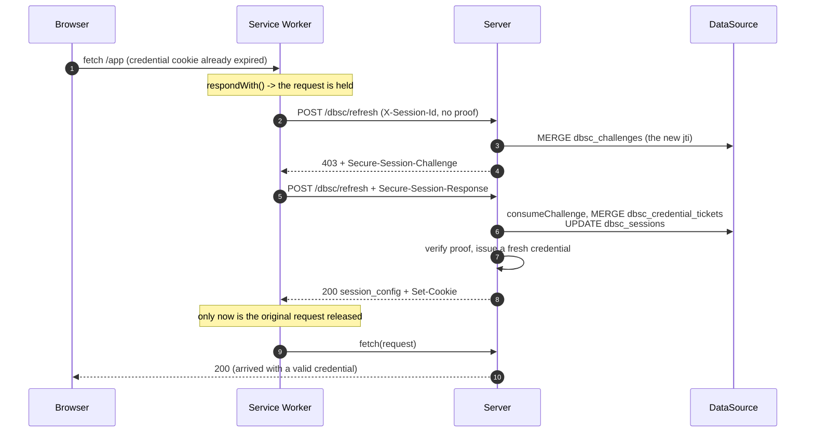

A failed refresh here **does not fail the request**. The server is about to answer that
very request and is the authority on whether the session is still good; injecting a
synthetic error would replace a real answer with a worse one, and would break the
routes that do not care about DBSC at all.

##### 4. Signing out

There is nothing script-specific here, and that is the point: logout is a plain form
POST, and the server ends the binding on the way out. `terminate()` writes
`Secure-Session-Terminate`, which makes the browser forget the credential, and revokes
the record so a captured cookie stops resolving. The worker keeps running — the next
login will need it again — and its local key is simply never used again; a client that
wants it gone sooner calls `forgetDbsc()` from the page.

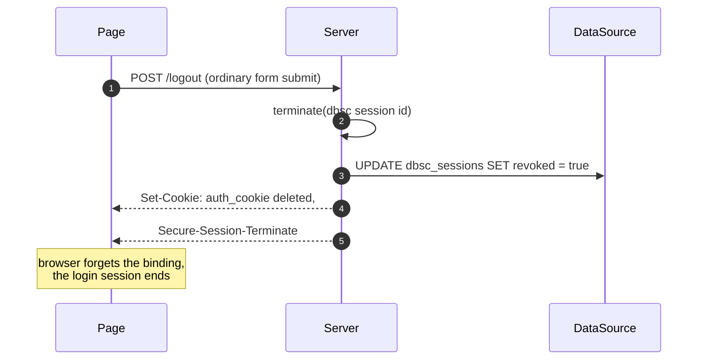

Skipping `terminate()` is the classic way to get this wrong: the device key then
outlives the login, the browser keeps refreshing a session the application has already
ended, and the *next* login re-couples to a stale key instead of registering a fresh
one. The README-DEMO pitfalls list records it for the same reason.

#### Why a Service Worker, and not a timer

The specification names two refresh triggers (`dbsc.html` §5, §6):

> The refresh endpoint is contacted **every time a request is made with an expired
> bound cookie**, and its response **blocks the original request**.
>
> If a session credential **will expire soon, and an in-scope document is active**, the
> user agent can refresh proactively to eliminate latency on an upcoming request.

The first is the primary one, and it is only implementable by something that **sees a
request before it goes to the network**. A Service Worker's `fetch` event is the only
place a script can do that. So `dbsc-soft-sw.js` refreshes ahead of any same-origin
request when the binding is old, and lets the request through afterwards — the same
blocking shape the specification describes, minus the TPM.

A page-local `setTimeout`, which is what earlier versions of this client used, can only
approximate the *second* trigger. It also dies with the document, so a page nobody is
looking at stops refreshing and the session demotes to `tier: none`
`binding-cookie-ttl` after the last refresh. The worker outlives navigations and tab
closes: as long as the origin has any client at all, the session stays alive.

Both triggers therefore live on the worker side, and the client module is context-free
— `dbsc-soft-client.js` has no `document`, `window` or DOM dependency and can be driven
from either. `initDbsc()` is still exported for deployments that cannot register a
worker; it is the timer-shaped entry point, and the one to avoid if you can. See
[below](#both-files-are-classic-scripts-and-that-is-not-cosmetic) for why both files are
classic scripts rather than modules.

A **SharedWorker** would not do here, which is worth stating because it is the obvious
first idea. It can hold one timer for the origin, which covers the proactive trigger,
but it cannot see a `fetch` at all, so the primary trigger is unreachable from it — and
Safari, one of the two browsers this fallback exists for, does not implement it.

#### Both files are classic scripts, and that is not cosmetic

`dbsc-soft-sw.js` loads the client with `importScripts()`, which only works for classic
scripts, so `dbsc-soft-client.js` publishes itself as `self.DbscSoft` instead of using
`export`. The alternative — `register('/dbsc-soft-sw.js', { type: 'module' })` — would
let the worker use `import`, but **Safari does not implement module workers**. A module
worker here would mean a client written for Safari that does not run on Safari, so:

- register the worker plainly, with no `{ type: "module" }`
- the client is a classic script; do not `<script type="module">` it
- `importScripts()` evaluates into the worker's own scope, so every call into the client
  is qualified (`self.DbscSoft.refresh()`), never destructured

It keeps its key in **IndexedDB** (non-extractable where the browser allows) and drives
the same routes native Chromium drives — the same offer headers, the same registration
path, the same refresh exchange. Nothing is special-cased server-side for it beyond the
re-offer route below.

#### Telling it how long the cookie lives

The refresh cadence is not discoverable from a script. A native browser reads it off
the credential cookie's `Max-Age`, which is `HttpOnly` and therefore invisible to both
a document and a worker, and the JSON session config carries no such field. So the
worker is configured with it:

```js
const BINDING_COOKIE_TTL_MS = 180_000;   // must match dbsc.binding-cookie-ttl
const REFRESH_MARGIN_MS = 5_000;         // fire this far ahead of the TTL
```

Set it to `dbsc.binding-cookie-ttl`. Too long is the failure to watch for — the cookie
lapses between refreshes, the session demotes to `tier: none`, and every guarded route
starts refusing a client that looks otherwise healthy.

**Edit the file to do this.** `dbsc-soft-sw.js` and `dbsc-soft-client.js` are served
verbatim: there is no build step, no template and no config route behind them, so the
constant is the configuration. The same applies to the route paths in the client's
`CONFIG` and to `PROTECTED_PREFIXES` below — see
[What the worker refreshes for](#what-the-worker-refreshes-for). Both files carry the
same instruction at the point of edit, so a deployer editing one finds it.

The worker tracks the last exchange the server answered and compares against that
figure, so a request arriving a second after a refresh does not trigger another. That
matters: the `fetch` hook runs on *every* same-origin request, and without the check
every page load would cost a refresh round trip.

#### What the worker refreshes for

Only the routes your guard protects are touched, as a prefix test:

```js
const PROTECTED_PREFIXES = ["/app/"];   // the demo's app surface
const SESSION_DESTINATIONS = new Set(["", "document"]);
```

This is an **allowlist, not a denylist**, and the direction matters. The question it
answers is "could this request's outcome depend on the credential cookie?", and only the
application knows — so a route the deployer has not thought about should be *skipped*,
not swept in. A denylist gets that backwards: `isSessionRequest` would return true for
everything not named, and the sweep is invisible from the config.

Two filters do the work:

- **The path prefix** is the coarse one, and it should mirror your
`DbscGuardRoutes`. The costs of drift are asymmetric, so it is worth knowing which way
is dangerous: a route listed here that the guard does not protect costs a wasted refresh
round trip; a guarded route *missing* here is never refreshed proactively, so it starts
refusing at the TTL. **List what the guard protects.**
- **`request.destination`** drops subresources in one step. A page load pulls in dozens
of images, fonts and stylesheets that carry no credential, and each one used to trigger
its own refresh check — that is what made a single navigation cost a burst of network
I/O and IndexedDB opens.

The worker will not touch the protocol routes either, though not by naming them:
`/dbsc/refresh` is only reached by a `fetch` with an empty destination and a path that
`PROTECTED_PREFIXES` does not match, so it is skipped before any of this matters. That
is what keeps the refresh from triggering itself and recursing — the reason the old
denylist named `/dbsc/` explicitly. **If you ever add a `/dbsc` prefix to
`PROTECTED_PREFIXES`, you reintroduce that deadlock.**

A failed refresh never fails the request either: the server is about to answer that
request anyway, and it is the authority on whether the session is still good.

#### It declines to run on browsers that should register natively

`expectsNativeDbsc()` returns true for the Chromium family on Windows — the platform
where native DBSC has shipped. **Android is deliberately excluded**: Chromium's native
implementation is not available there yet, so treating it as native would skip the
registration this client exists for and leave the session unbound with no error. A false
positive here is worse than a false negative, which is why this is an explicit platform
list rather than feature detection. Add `Android` only once the native path ships there.

**The check belongs on the page, before the worker is registered.** It is not enough for
`bindSession()` to decline later: registering the worker installs a `fetch` hook that
runs on every same-origin request of every page, for a binding that will never happen.
On Chromium that is pure overhead against a tier that already works, so the snippet above
gates the whole thing — no `register()` call, no worker, no hook. `bindSession()` still
performs the check as well, because a client that reaches it another way must not bind a
software key to a session that is about to get a hardware-backed one.

#### Turning it off

Soft DBSC is **on by default**. That is a deliberate choice: the browsers this exists
for — Safari, Firefox — have no native DBSC at all, so leaving it off means the whole
feature does nothing for them, and a deployment that never noticed the property would
inherit an inert feature rather than a weaker one. On is the more useful default and the
one that matches what the client code in this repository expects.

To turn it off anyway — because the trade below is not one you want to make — set:

```yaml
dbsc:
  soft:
    enabled: false
```

That single switch does two things: it stops registering `POST /dbsc/bind` (so the route
is a 404 and no client can start a soft binding) and it is what `DbscBindFilter` checks
before it will answer the route. Nothing else about the server changes — the device key
table and the native path are unaffected, and turning it off does not invalidate a key
that is already registered.

The reason to turn it off is the trust model, as the intro to this section describes: the
key lives in IndexedDB where any script on the origin can use it, so it is strictly
weaker than a hardware-backed one. On is the better default because the alternative for
these browsers is no protection rather than stronger protection — but it is a real
trade, not a free win.

Two files have to be reachable without authentication, since a module import or a
worker registration that is redirected to a login page fails before any of it runs.
Neither is a secret — they are the same scripts every visitor gets:

```java
.requestMatchers("/dbsc-soft-client.js", "/dbsc-soft-sw.js").permitAll()
```

#### What it does not do

- **It does not outlive the origin's compromise**, as above. It is `tier: dbsc` in the
  same sense as a native binding, because the server cannot tell the difference — but
  read [the tier](#the-protection-model) as a statement about what was verified, not
  about how strong the key is.
- **It does not detect a native binding; the server refuses it.** A browser that should
  register natively never gets here, because `expectsNativeDbsc()` stands the client
  down first. If the native tier has already registered for that session anyway, the
  re-offer comes back `SESSION_ALREADY_REGISTERED` and the bind exchange reports
  `{ phase: "already-bound" }` — it does not try to replace the native key. That is one
  binding per session either way.
- **It is not a polyfill.** It does not make `navigator` expose DBSC, does not change
  what any other script sees, and does not affect the browser's own handling of the
  offer headers. The server sees an ordinary DBSC client.
- **It does not survive a browser shutdown.** The key persists in IndexedDB, and the
  worker survives navigation and tab closes, but a browser that is closed entirely runs
  no worker. The session demotes after `binding-cookie-ttl` and recovers on the next
  visit, when the worker's next intercepted request refreshes it.
- **It needs a Service Worker.** Where there is none, there is no interception and no
  outliving the document. Use `initDbsc()` in that case and accept the timer's limits.
- **Its two files must not be renamed independently.** The worker loads the client by
  absolute path (`importScripts("/dbsc-soft-client.js")`), because a Service Worker's
  scope is its own script's directory and it has no document to resolve a relative
  import against. Serve both from the root, or change the path in the worker.

### `POST /dbsc/bind` — ask for an offer

`bind()` writes its offer onto the response of whatever request called it, and a script
can only act once its own code is running. That is an ordering problem the native flow
does not have: Chromium reads the offer from the navigation itself, whenever it happens.
A service worker may not even be installed at the moment the login response goes out.

This route is the way back. It answers with the headers `bind()` would have written — the
same `Secure-Session-Registration`, the same `Secure-Session-Challenge` — so a client
parses one wire format and POSTs to one registration path no matter which route offered
it:

```
POST /dbsc/bind            (authenticated; names its session from your session cookie)
    → 200
      Secure-Session-Registration: (ES256);path="/dbsc/regist/<token>";challenge="<jti>"
      Secure-Session-Challenge: "<jti>";id="<sessionId>"

POST /dbsc/regist/<token>  (the ordinary registration route)
      Secure-Session-Response: "<jws>"
    → 200 + JSON session config
```

**The session comes from your own session cookie, not from the path.** That is the whole
difference between this route and the registration route, and it is why this one is
expected to sit behind your authentication: it is only ever reached by a same-origin
`fetch` from a page the client is already logged in on. An unauthenticated caller has no
session, so there is no session to re-offer for, and the answer is the same
`SESSION_NOT_FOUND` any unknown session gets.

**CSRF applies, because this is an ordinary application route.** There is no
DBSC-specific check here: put the route on your application chain behind your
authentication, leave your normal CSRF on, and the standard `CsrfFilter` protects it.
The client sends the token as a header, read from a meta tag on the page:

```html
<meta name="csrf" th:content="${_csrf.token}"/>
<meta name="csrf-header" th:content="${_csrf.headerName}"/>
```

`dbsc-soft-client.js` reads both spellings (`csrf` / `csrf-header`, and Thymeleaf's own
`_csrf` / `_csrf_header`), so either markup works. Two configuration details matter:

- **The chain must keep sessions.** The default `HttpSessionCsrfTokenRepository` stores
the token on the `HttpSession`, so `SessionCreationPolicy.STATELESS` on the chain that
holds this route leaves it nowhere to store one and every POST is refused. This is worth
calling out because nothing fails at startup and the resulting bare 403 looks exactly
like a DBSC refusal. The protocol chain can stay stateless — CSRF is off there.
- **Use `CsrfTokenRequestAttributeHandler`.** Spring Security's default handler masks the
token per request with a BREACH nonce, which is right for a form your server renders and
wrong for a client that holds the raw value from a meta tag.

A session that already holds a device key is refused with `SESSION_ALREADY_REGISTERED`.
Letting it re-register would let a client replace the key it proved possession of
without proving possession of the new one.

Each call mints a fresh challenge and a fresh single-use token, superseding whatever the
previous call offered. The token is *not* spent by this route — it is the credential for
the registration POST that follows, so spending it here would hand out a path that is
already dead. Single-use is enforced where it has to be: on the registration POST, which
spends the token before it reads the proof.

### `X-Session-Id` on refresh

The refresh route names its session by header, because by then the credential cookie is
expired. Native DBSC uses `Sec-Secure-Session-Id`; a script may use `X-Session-Id`
instead, and both are read:

```
POST /dbsc/refresh
X-Session-Id: <sessionId>          ← or Sec-Secure-Session-Id; both work
    → 403 + Secure-Session-Challenge   (first leg: proof not yet supplied)

POST /dbsc/refresh
X-Session-Id: <sessionId>
Secure-Session-Response: "<jws>"
    → 200 + JSON session config + a fresh credential cookie
```

The second name exists because `Sec-` is reserved by RFC 6648 for protocol-defined
headers and is outside the CORS safelist, so a `fetch` carrying it is preflighted and the
name has to be allowed by every deployment. `X-Session-Id` carries the same value with
none of that. It is read first when both are present, though neither takes precedence in
any way that affects the outcome: an unusable value fails the same lookup from either
name.

Whatever the client sends must be the session id, not the credential cookie's value.
That value is a ticket which rotates on every refresh, so it names a ticket rather than
a session — a refresh that accepted it would be resolving a session by a value whose
whole purpose is to stop being one.

### What such a client has to do itself

- **Generate the key.** P-256, and `extractable: false` if you can — it will not stop
the origin from *using* the key, but it stops it from *copying* it.
- **Sign in the shapes the route expects.** Registration carries `typ: "dbsc+jwt"` and
the public key as a `jwk` header parameter; refresh carries the same `typ` and **no
`jwk`**, which is a protocol error there. Both sign `{ "jti": <challenge> }`, and the
signature is raw `r||s` — which is what WebCrypto's ECDSA already returns, so no DER
conversion is needed (Java's `Signature` does return DER, which is why the test
fixtures convert).
- **Send the proof in `Secure-Session-Response`, not in the body.** A POST to either
route without that header is `MISSING_RESPONSE_HEADER`.
- **Refresh explicitly.** Nothing will do it for you: there is no browser-side timer to
rely on. The one place a script *can* observe the specification's primary trigger —
"contacted every time a request is made with an expired bound cookie" — is a Service
Worker's `fetch` event, which is what `dbsc-soft-sw.js` does. A `setInterval` in a
document works too, until the document goes away. Either way, refresh before the
credential cookie's `binding-cookie-ttl` elapses, or the session demotes to
`tier: none` and the guard will refuse the next request.

## Binding behind OIDC or SAML: why the first offer fails

This section explains why the registration token travels in the URL rather than in a
cookie. The failure it describes is real and worth understanding — it is what the design
solves — but with the current library there is nothing for you to do about it.

Cross-site is a problem for the registration POST however the session is identified in
a cookie, because Chromium withholds *all* of them from that POST:

```
GET  /login/oauth2/code/entraid   302   cookies set
POST /dbsc/regist/<token>         200   no cookie sent
```

That is why nothing on the registration path may depend on a cookie naming the
session, and it is worth knowing even though the library has already arranged it: if
you are reading a cookie of your own in a component that runs on that path, it will be
absent exactly when the login callback is what triggered the request.

### How the token in the path removes the problem

An earlier design named the session with a `__Host-dbsc-reg` cookie. Cross-site, that
cookie was withheld along with your own session cookie, so the registration route saw a
request with no session and answered `403` — and Chromium records that failure as
permanent and does not retry for the rest of that login, leaving the session at
`tier: none` no matter how long it lives.

`bind()` no longer sets that cookie. It mints a **single-use registration token** and
advertises the session's identity in the registration **URL**:

```
POST /dbsc/regist/1234-56789-01234-56789
```

The POST is resolvable from the path alone, so it does not matter that cookies were
withheld and the cross-site initiator stops being a problem. Binding in the
OIDC success handler — the obvious place — now works, with no relay hop and no
application-side workaround.

A server-side redirect does **not** reset the initiator: `302`/`303` to your own page
still leaves the callback as the initiator. Only a navigation the *browser* issues on
its own — a click, a page load, a script-driven location change — does. Nothing in this
library needs one any more; the note is here because it still governs what `bind()`
may rely on if you call it somewhere else.

Two consequences worth knowing:

- **The token is single-use**, consumed by a successful registration. A second
  registration on an already-registered session is an error
  (`SESSION_ALREADY_REGISTERED`) — that is the protocol, not a limitation.
- **`registration-path` is a prefix**, not a fixed path. The concrete route is
  `<prefix>/<token>`. Never build the header yourself; `bind()` does it, and
  `DbscService.registrationPathFor(token)` is the accessor if you need it.

The challenge is unaffected and still required: it is how the server knows which
JTI was signed. The challenge no longer travels in a cookie — `bind()` offers it in
the `Secure-Session-Challenge` header, and the server keeps it against the session
and looks it up when the registration POST arrives.

For form login none of this ever applied. Form login owns the POST the browser made to
your own origin, so the success handler *is* same-site and a single `bind()` there is
complete.

`bind()` is safe to call more than once: it costs one challenge plus two cookie writes
and a fresh token each time, and Chromium ignores the offer once the session has
registered. Each call writes its own session record, so a second call under the same id
replaces the first. Keep it off hot paths, and never call it from an unauthenticated
route — `bind()` trusts its arguments.

## Things worth knowing

A few behaviours are load-bearing and easy to get wrong if you reimplement or
extend this:

- **Never 401 on the refresh route.** Chromium ignores 401 there and the
  session silently dies. Every DBSC failure is 403, except a structurally incomplete
  request (400).
- **A failed refresh signature must consume the challenge and demote to
  `none`.** That demotion is the actual theft response, not a side effect.
- **`200` with no JSON body on a protocol route means opt-out**, and the browser
  drops the session. Always return the JSON config on success.
- **The `attributes` string in the JSON config must match the real
  `Set-Cookie` bytes**, so the browser's cookie matcher recognises it. It
  deliberately excludes `Max-Age`, which the spec's match set does not include.
- **`tier` is what makes a session protected, not the presence of a key.** A
  demoted session keeps its key on purpose (so a later failure is still recognisable
  as `session_stolen`), which is why `tierFor()` reads the stored tier rather than
  inferring protection from the key.
- **`scope_specification` is read in reverse by the browser**, so the array order you
  write is the precedence — last match wins. Sorting or de-duplicating the list would
  silently invert it.
- **Nothing on the server enforces scope.** `scope_specification` and
  `allowed_refresh_initiators` are instructions to the user agent; the server happily
  answers a refresh for a URL the browser should never have attached the credential to.
  Do not treat them as authorization.
- **A wrong `scope.origin` fails in the browser, not here.** §8.9 terminates the session
  on a same-site mismatch, so the server answers 200 while Chromium discards it. That is
  why `dbsc.scope-origin` is validated at startup instead of at first use.

## License

[MIT](./LICENSE).
