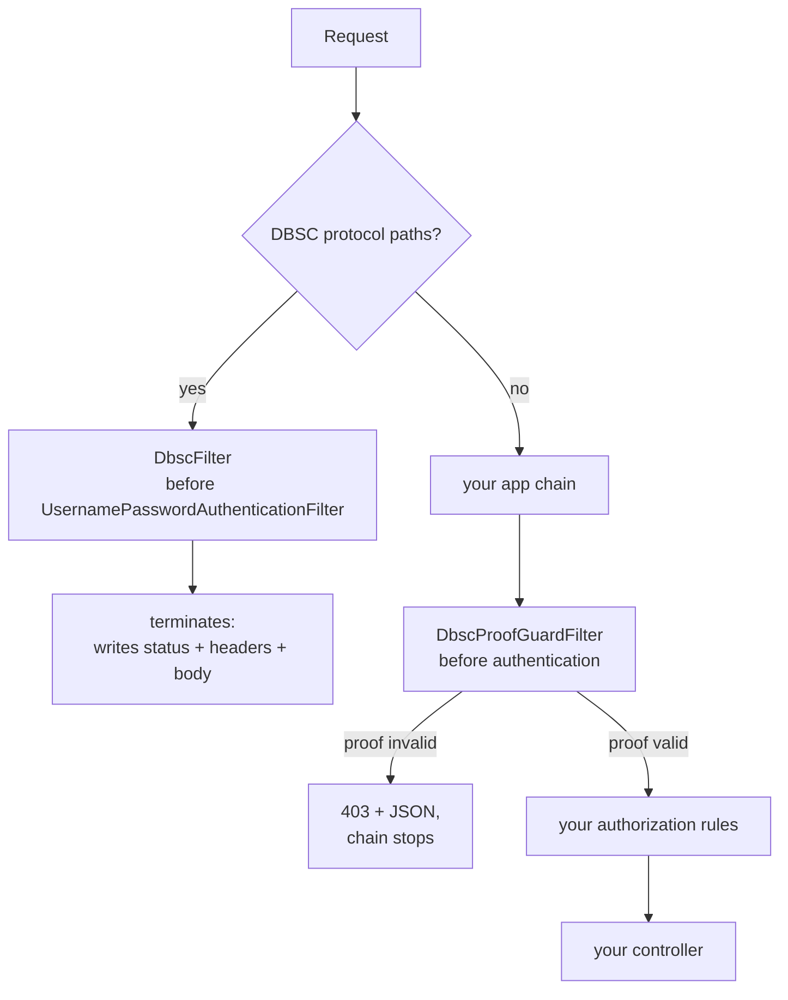

# spring-dbsc

[](https://github.com/yuukioosaka/spring-dbsc/actions/workflows/build.yml)
[](./LICENSE)

A Spring Boot **library** implementation of **DBSC (Device Bound Session
Credentials)**, built against the [W3C draft](https://w3c.github.io/webappsec-dbsc/)
and the [`dbsc-toolkit`](https://www.npmjs.com/package/dbsc-toolkit) protocol
specification.

This artifact is meant to be **embedded in an existing Spring Boot application**:
it ships no `@SpringBootApplication` and no controllers. You add it as a
dependency, call `bind()` from your own login route, and declare which of your
existing routes need a proof.

The point of DBSC: a session cookie that is stolen off the wire is useless on
another device, because the session is bound to a private key that never leaves
the browser. A stolen cookie either fails a per-request signature check, or gets
the session demoted to `none` the moment someone tries to refresh with it.

## What's implemented

| Area | Status |
|---|---|
| Native protocol (Chromium, spec 02) | ✅ registration + refresh |
| Bound protocol (Web Crypto polyfill, spec 03) | ✅ all four routes |
| Per-request proof guard (spec 04) | ✅ incl. body binding |
| Atomic challenge consumption | ✅ in-memory + JDBC |
| Proof replay cache | ✅ in-memory + JDBC |
| Tier model + demotion-on-failure | ✅ |
| Telemetry events | ✅ 6 event types |
| Rate limiting | ✅ |
| DPoP (spec 10) | ❌ out of scope — an orthogonal layer |

**Test status: 112 tests passing**, including all 8 conformance vectors from
`dbsc-toolkit/spec/vectors` replayed through the real engine.

## Requirements

The library is compiled at the **Java 17** release level, so its class files load on
JDK 17 and every later JDK — 17, 21 and 25 all work. Java 17 is the lowest JDK Spring
Boot 3.5 supports, and it is the CI baseline.

Spring Boot 3.5.x and Spring Security 6.5.x are the tested versions.

## Getting Started

### 1. Add the dependency

```xml
<dependency>
  <groupId>click.yukio.dbsc</groupId>
  <artifactId>spring-dbsc</artifactId>
  <version>0.2.0</version>
</dependency>
```

That is the whole installation. A normal Boot app picks up `DbscAutoConfiguration`
from the JAR's `META-INF/spring/org.springframework.boot.autoconfigure.AutoConfiguration.imports`
— no extra annotation.

### 2. Wire the filters into your chain

The library ships **two `OncePerRequestFilter` beans and no `SecurityFilterChain`.**
Nothing is registered into Spring Security for you, because *where* the filters sit,
which paths bypass authentication, and what authorization runs underneath them are
policy decisions that belong to your application. A library-supplied chain would either
collide with yours (two chains matching `/**` is a hard startup error) or, worse, be
kept and silently replace your authorization rules.

So the setup is two chains: a small protocol chain that must stay unauthenticated, and
your own application chain. Both filters are declared for you — `DbscFilter` and
`DbscProofGuardFilter` arrive as beans from `DbscFilterConfiguration`.

```java
@Configuration
@EnableWebSecurity
public class MySecurityConfig {

    /** Protocol routes: driven by the browser, before any session exists. */
    @Bean
    @Order(0)
    public SecurityFilterChain dbscProtocolChain(HttpSecurity http, DbscFilter dbscFilter)
            throws Exception {
        http
                .securityMatcher(new OrRequestMatcher(
                        new AntPathRequestMatcher("/dbsc/**"),
                        new AntPathRequestMatcher("/dbsc-bound/**"),
                        new AntPathRequestMatcher("/.well-known/device-bound-sessions")))
                .authorizeHttpRequests(auth -> auth.anyRequest().permitAll())
                .sessionManagement(s -> s.sessionCreationPolicy(SessionCreationPolicy.STATELESS))
                .csrf(CsrfConfigurer::disable)
                .addFilterBefore(dbscFilter, UsernamePasswordAuthenticationFilter.class);
        return http.build();
    }

    /** Your application, with the DBSC proof guard layered on top of it. */
    @Bean
    @Order(1)
    public SecurityFilterChain appChain(HttpSecurity http, DbscProofGuardFilter guardFilter)
            throws Exception {
        http
                .authorizeHttpRequests(auth -> auth
                        .requestMatchers("/login", "/css/**").permitAll()
                        .requestMatchers("/api/transfer").authenticated())
                // Before authentication: DBSC's 403 must never become a 401.
                .addFilterBefore(guardFilter, UsernamePasswordAuthenticationFilter.class);
        return http.build();
    }
}
```

The three details that actually matter, and how each one fails:

| Detail | If you get it wrong |
|---|---|
| `OrRequestMatcher` for the protocol paths — `securityMatcher()` **sets**, it does not accumulate | Only the last path is matched; the rest fall through to your chain, which answers a Spring 403 before `DbscFilter` runs |
| `addFilterBefore(..., UsernamePasswordAuthenticationFilter.class)` **and** CSRF off on the protocol chain | The browser's registration POST is rejected by CSRF first, or Security's entry point turns DBSC's 403 into a 401 — which Chromium treats as fatal and deletes the session |
| One filter **bean per chain** | `OncePerRequestFilter` records itself in a request attribute, so the same instance in a second chain silently skips it |

Anchoring on `UsernamePasswordAuthenticationFilter.class` is **not** a dependency on
form login. `HttpSecurity` registers that class as an ordering *position* when it is
constructed; `formLogin()` merely adds an instance at that position. Only an anchor
naming a filter **instance** would require the filter to exist, so this is valid for
OIDC, HTTP Basic, pre-authentication, and no authentication at all.

Boot also auto-registers every `Filter` bean as a plain servlet filter *outside* the
security chain, which would run both filters a second time on every path. Disable that:

```java
@Bean
FilterRegistrationBean<DbscFilter> dbscFilterRegistration(DbscFilter filter) {
    var registration = new FilterRegistrationBean<>(filter);
    registration.setEnabled(false);
    return registration;
}
```

### Examples

#### OIDC / `oauth2Login()`

DBSC binds a session that already exists, so it composes with any authentication
mechanism. Put `bind()` in a success handler — a redirect flow never reaches a
controller, so a success handler is the only place that sees the request, the response
and the authenticated principal together:

```java
@Configuration
@EnableWebSecurity
public class OidcSecurityConfig {

    @Bean
    SecurityFilterChain appChain(HttpSecurity http,
                                 DbscProofGuardFilter guardFilter,
                                 DbscService dbsc) throws Exception {
        http
                .authorizeHttpRequests(auth -> auth
                        .requestMatchers("/login/**", "/oauth2/**").permitAll()
                        .requestMatchers("/api/transfer").authenticated()
                        .anyRequest().authenticated())
                .oauth2Login(oauth2 -> oauth2.successHandler((request, response, auth) -> {
                    var user = (OidcUser) auth.getPrincipal();
                    dbsc.bind(sessionIdFor(request), user.getSubject(),
                              86_400_000L, request, response);
                    response.sendRedirect("/");
                }))
                .addFilterBefore(guardFilter, UsernamePasswordAuthenticationFilter.class);
        return http.build();
    }

    /**
     * The session id DBSC binds to. It must be stable for the browser session
     * across requests, because every later proof is checked against the session
     * record created here.
     *
     * <p>The OIDC subject is NOT suitable: it identifies the user, not the
     * browser, so it is shared across tabs, devices and concurrent logins. Binding
     * to it would make two browsers share one DBSC session and let either one
     * satisfy the other's proofs.
     *
     * <p>Use whatever your application already treats as the session identifier.
     * With an HttpSession, that is its id:
     */
    private static String sessionIdFor(HttpServletRequest request) {
        return request.getSession().getId();
    }
}
```

Because OIDC already redirects after login, `bind()` in the success handler is enough —
there is no separate login route to decorate, unlike the password example below.

`request.getSession().getId()` is the right answer whenever the app keeps an
`HttpSession`. Note the ordering: `bind()` reads the session, so the session must already
exist at that point. In a success handler it does, because authentication created it.

If your app is **stateless** and has no `HttpSession`, do not invent one just for this —
bind to whatever opaque id you already mint per client, as in the stateless example
below. What matters is that the id is **per browser session** and **reused across every
subsequent request from that session**, since the DBSC record is looked up by it on
each refresh and each guarded request.

#### Form login (password)

Form login owns the POST that ends authentication, so the binding has to be made from
the success handler there too:

```java
@Bean
SecurityFilterChain appChain(HttpSecurity http,
                             DbscProofGuardFilter guardFilter,
                             DbscService dbsc) throws Exception {
    http
            .authorizeHttpRequests(auth -> auth
                    .requestMatchers("/login", "/css/**").permitAll()
                    .requestMatchers("/api/transfer").authenticated())
            .formLogin(form -> form
                    .loginPage("/login")
                    .successHandler((request, response, auth) -> {
                        dbsc.bind(request.getSession().getId(), auth.getName(),
                                  86_400_000L, request, response);
                        response.sendRedirect("/");
                    }))
            .logout(logout -> logout.logoutSuccessHandler((request, response, auth) ->
                    dbsc.sessionFor(request)
                            .ifPresent(s -> dbsc.terminate(s.id(), request, response))))
            .addFilterBefore(guardFilter, UsernamePasswordAuthenticationFilter.class);
    return http.build();
}
```

`src/demo` is a complete, runnable form-login app over HTTPS, and
`src/demo/resources/README-DEMO.md` records the failure modes it exists to catch.

#### Stateless API / bearer tokens

With no HTTP session at all, choose a session id that is stable for the *client*, not
the request, and route the cookie through the response yourself:

```java
@PostMapping("/login")
public TokenResponse login(@RequestBody Credentials credentials,
                           HttpServletRequest request,
                           HttpServletResponse response) {
    var principal = authenticate(credentials);          // your own auth
    var sessionId = "sess_" + UUID.randomUUID();         // your own session store
    dbsc.bind(sessionId, principal.id(), 86_400_000L, request, response);
    return new TokenResponse(sessionId);
}
```

#### No Spring Security at all

The filters are not Security components — nothing in either one touches a Security
request wrapper or context. Register them as plain servlet filters:

```java
@Bean
FilterRegistrationBean<DbscFilter> dbscFilterRegistration(DbscFilter filter) {
    var registration = new FilterRegistrationBean<>(filter);
    registration.addUrlPatterns("/dbsc/*", "/dbsc-bound/*", "/.well-known/*");
    registration.setOrder(Ordered.HIGHEST_PRECEDENCE + 10);
    return registration;
}
```

### 3. Bind, guard, terminate

Now the three lifetime calls. Details and the reasoning are in
[Wiring it into your own app](#wiring-it-into-your-own-app); the short version:

- **`dbsc.bind(sessionId, userId, ttlMillis, request, response)`** — at the end of your
  login handler. Binding is idempotent per session; the browser does the rest of the
  native registration on its own.
- **`GuardedRoute` beans** — declare which paths need a per-request proof.
  Nothing is guarded by default.
- **`dbsc.terminate(...)`** — on logout, so the browser forgets the binding instead of
  retrying against a dead session.

## Architecture

The protocol is served by **two `OncePerRequestFilter`s wired into the Spring
Security chain**, not by controllers:

| Filter | Responsibility |
|---|---|
| `DbscFilter` | Owns every protocol route (`/dbsc/*`, `/dbsc-bound/*`, `/.well-known/device-bound-sessions`). Terminates the chain for those paths. |
| `DbscProofGuardFilter` | Enforces a per-request proof on the paths you declare as `GuardedRoute`. Goes in *your* chain. |

`DbscService` sits below both as the HTTP facade, and `DbscProtocolEngine` below
that as the protocol itself — neither depends on Spring Security. See
[How it is wired (and why)](#how-it-is-wired-and-why) for the reasoning.

## Running the tests

The build is on GitHub Actions:

- **[`build.yml`](./.github/workflows/build.yml)** — `mvn verify` on Java 17, 21 and 25
  (blocking) and 26 (experimental). Uploads the library JAR.
- **[`e2e.yml`](./.github/workflows/e2e.yml)** — boots the demo over HTTPS with a
  2-second challenge TTL and runs `scripts/e2e.py` against it.

The second one exists because the expiry scenarios are only reachable at a tiny TTL;
at the 5-minute default the suite skips `CHALLENGE_EXPIRED` rather than testing it.

Locally:

```sh
mvn verify
```

The web tests run against `DbscTestHostApplication` in `src/test` — a miniature
host app that stands in for yours: a login route that calls `bind()`, a `whoami`
route, a guarded `payment` route, and a logout route. Read it first when wiring
the library up; it is the smallest complete integration.

## What is not in this repository

- `dbsc-toolkit/` and `dbsc.html` — the protocol specification and reference
  implementation this library was built against. They are separate artifacts and are
  not redistributed here; the conformance vectors this build tests against are vendored
  under `src/test/resources/vectors/`.
- `dbsc-toolkit/spec/vectors` is the origin of those vendored vectors. If you have the
  toolkit checked out, copy from there rather than editing the copies by hand.

## Wiring it into your own app

### 1. Get the auto-configuration on the classpath

The library ships `META-INF/spring/org.springframework.boot.autoconfigure.AutoConfiguration.imports`,
so a normal Boot app picks up `DbscAutoConfiguration` with no extra annotation —
just depend on the JAR.

If you disable Boot's auto-configuration, or want the wiring visible, import it
explicitly:

```java
@SpringBootApplication
@Import(DbscAutoConfiguration.class)
public class MyApplication { ... }
```

The auto-config is guarded by `dbsc.enabled`, defaulting to `true`.

### 2. Bind a session from your login route

DBSC does not authenticate. It **binds a session that already exists**, so the
call goes at the end of your existing login handler:

```java
@PostMapping("/login")
public Session login(HttpServletRequest request, HttpServletResponse response) {
    Session session = authenticate(request);       // your own auth
    dbsc.bind(session.id(), session.userId(), 86_400_000L, request, response);
    return session;
}
```

That single call persists the session record, sets the registration + challenge
cookies, and adds `Secure-Session-Registration`. Chromium then calls
`/dbsc/registration` on its own within about a second — there is no client code to
write for the native path.

On logout, call `dbsc.terminate(...)` so the browser forgets the binding
immediately instead of retrying against a dead session:

```java
@PostMapping("/logout")
public void logout(HttpServletRequest request, HttpServletResponse response) {
    dbsc.sessionFor(request).ifPresent(s -> dbsc.terminate(s.id(), request, response));
    invalidateYourOwnSession(request);
}
```

### 3. Guard the routes that matter

A guarded route requires a `bound` key plus a fresh `X-Dbsc-Bound-Proof`. Declare the
paths:

```java
@Bean
GuardedRoute transferRoute() {
    return GuardedRoute.withBody("/api/transfer");
}
```

`withBody` binds the request body into the proof, so a captured proof cannot be
replayed against a modified payload. Use `withoutBody` for routes with no
meaningful body.

Declaring the route gives the guard filter something to enforce; **the filter itself
still has to be in the chain serving that path**, which is the `appChain` bean in step
2. Both halves are required, and a `GuardedRoute` with no guard filter in the matching
chain enforces nothing.

**Nothing is guarded by default.** Adopting DBSC never silently changes the
behaviour of existing endpoints; guarding is opt-in per path.

## How it is wired (and why)

DBSC is implemented as **two `OncePerRequestFilter`s** rather than controllers, and
both live in the Spring Security chain:



The reasons for filters rather than controllers:

- **These are a protocol surface, not endpoints.** The routes must be reachable
  before any application session exists, and must answer with DBSC's own status
  contract. A filter that terminates the chain enforces that structurally: the
  routes cannot be re-mapped, shadowed by a peer controller, or re-secured.
- **403 vs 401 is load-bearing, and only a filter can guarantee it.** Chromium
  treats a 401 on the refresh route as fatal and terminates the session, so DBSC
  must answer 403. If Spring Security handled these paths itself it would answer
  401 first. `DbscFilter` is registered *before* Spring Security's authentication
  entry points precisely so nothing upstream can replace that status.
- **One filter replaces two collaborating pieces.** The earlier interceptor-based
  guard had to read the body to hash it, which required a *second* filter to make
  the body replayable for the handler. As a filter, the guard buffers the body
  once and passes a `ReplayableBodyRequest` down the chain — the round trip
  through the servlet body is now handled in one place.

### Using your own `SecurityFilterChain`

That is the only way to use the library — [Getting Started](#getting-started) is the
full worked example, and the two chains there are the shape to copy. This section only
adds the reasoning behind the filter placement.

Two placement rules, and what breaks without them:

- **`dbscFilter` goes in the chain that owns the protocol paths, before
authentication.** Security would otherwise answer 401 there, and Chromium treats 401
on the refresh route as fatal.
- **`dbscProofGuardFilter` goes in your application chain, before authentication.**
It layers on top of authorization: a valid proof is never a substitute for being
authenticated.

One instance per chain. `OncePerRequestFilter` records that it has run in a request
attribute, so registering the *same* instance in two chains makes the second chain
silently skip it.

And the detail that is easy to miss: **the protocol paths must be served by a chain with
CSRF disabled.** The browser's registration POST carries no CSRF token, so a chain that
applies CSRF to `/dbsc/**` rejects it before `DbscFilter` ever runs.

If you do not use Spring Security at all, see
[No Spring Security at all](#no-spring-security-at-all) — the filters are not Security
components and register as plain servlet filters.

### Replace the collaborators you have opinions about

`DbscAutoConfiguration` backs off with `@ConditionalOnMissingBean` on every
bean, so defining your own replaces the default. The ones most worth replacing:

| Bean | Default | Replace when |
|---|---|---|
| `StorageAdapter` | JDBC, else in-memory | You already have a session store — implement the interface; the only hard requirement is an **atomic** `consumeChallenge` |
| `ProofReplayCache` | JDBC, else in-memory | You run more than one process (the in-memory cache is per-JVM) |
| `RateLimiter` | In-memory, per-IP | Same — or you use a gateway/bucket you already have |
| `Clock` | `Clock.systemUTC()` | You need to freeze time. Override the bean **named `dbscClock`** (`@ConditionalOnMissingBean(name = "dbscClock")`) |

```java
@Bean
StorageAdapter dbscStorage(MyRedisClient redis) {
    return new RedisStorageAdapter(redis);   // must make consumeChallenge atomic
}
```

`DbscService` itself is also `@ConditionalOnMissingBean`, but it is a plain
facade — wrapping or replacing it is rarely worth it.

## Configuration

All keys are prefixed `dbsc`. Defaults match the toolkit spec.

| Key | Default | Notes |
|---|---|---|
| `enabled` | `true` | `false` makes the whole feature a no-op |
| `bound` | `true` | `false` runs native only; bound routes are not served |
| `secure` | `true` | `__Host-` cookies + `Secure`. **Turn off only for localhost HTTP** |
| `cookie-scope` | `host` | `site` enables multi-subdomain and requires `cookie-domain` |
| `cookie-domain` | — | e.g. `example.com`; required for `site` scope |
| `registration-path` | `/dbsc/registration` | what the registration header advertises |
| `refresh-path` | `/dbsc/refresh` | also the `refresh_url` in the JSON config |
| `bound-path` | `/dbsc-bound` | base path of the polyfill routes |
| `bound-cookie-ttl` | `10m` | binding cookie lifetime == refresh cadence |
| `registration-cookie-ttl` | `24h` | |
| `challenge-ttl` | `5m` | |
| `refresh-grace` | `30s` | softens the freshness poll across a refresh |
| `timestamp-window` | `5m` | clock skew accepted in bound refreshes/proofs |
| `session-ttl` | `7d` | |
| `telemetry-per-request-proofs` | `false` | per-request proof outcomes are noisy |
| `rate-limit.enabled` | `true` | |
| `rate-limit.capacity` | `30` | per IP, per window |
| `rate-limit.window` | `1m` | |

### Storage

With a `DataSource` on the classpath, sessions, keys, challenges and replay
entries all live in the database (`dbsc.storage: jdbc`).

For tests and local dev, `dbsc.storage: memory` swaps in heap-backed adapters.
**Not for production**: every restart breaks live sessions, because the browser
still holds a cookie for a key the server no longer remembers.

```yaml
dbsc:
  storage: jdbc          # or: memory
  secure: true
  cookie-scope: site
  cookie-domain: example.com
```

#### Schema

The tables are created on startup by `JdbcStorageAdapter.initialize()` and
`JdbcProofReplayCache.initialize()`, which issue `CREATE TABLE IF NOT EXISTS` and are
safe to run on every boot. A fresh database needs no setup.

That default is convenient but it means the application's database user needs **DDL
rights at runtime**. Many production setups do not grant that, and some run schema
changes through a migration tool so that every change is reviewed and versioned. Both
are reasonable; pick one:

**Default — let the library create the schema.** No config. The runtime user needs
`CREATE TABLE` / `CREATE INDEX`.

**Managed — let your migration tool own it.** The same DDL is shipped as Flyway
migrations under [`src/main/resources/db/migration/`](./src/main/resources/db/migration):

| Migration | Contents |
|---|---|
| `V1__dbsc_storage.sql` | `dbsc_sessions`, `dbsc_bound_keys`, `dbsc_challenges` |
| `V2__dbsc_proof_replay.sql` | `dbsc_proof_replay` |

The DDL is **identical** to what `initialize()` issues, and both are idempotent, so
there is no conflict either way: applying the migrations and then starting the app
leaves the schema unchanged. That also means you can adopt migrations on an existing
deployment without a baseline step.

The SQL is deliberately portable — no vendor-specific types, no sequences — so the
same files work on PostgreSQL, MySQL, MariaDB, H2 and SQL Server. Timestamps are
`BIGINT` epoch milliseconds throughout, matching how the protocol carries them.

`V2` is a separate migration because `dbsc_proof_replay` belongs to a different
collaborator (`ProofReplayCache`) that an application may replace or omit. Keeping it
out of `V1` means the sessions schema does not depend on a component you might not use.

If you would rather not carry the migrations, the two `initialize()` methods are also
safe to call yourself from a schema-management hook — the DDL statements are quoted at
the top of `JdbcStorageAdapter` and `JdbcProofReplayCache`.

## Things worth knowing

A few behaviours are load-bearing and easy to get wrong if you reimplement or
extend this:

- **Never 401 on the native refresh route.** Chromium ignores 401 there and the
  session silently dies. Every DBSC failure is 403, except a missing
  bound-protocol cookie/field (400) and a tripped rate limit (429).
- **A failed refresh signature must consume the challenge and demote to
  `none`.** That demotion is the actual theft response, not a side effect.
- **`200` with no JSON body on a native route means opt-out**, and the browser
  drops the session. Always return the JSON config on success.
- **The `attributes` string in the JSON config must match the real
  `Set-Cookie` bytes**, so the browser's cookie matcher recognises it. It
  deliberately excludes `Max-Age`, which the spec's match set does not include.
- **Tier only climbs.** A session with a native key stays `dbsc` even after the
  polyfill co-registers, because the native binding is strictly stronger.

## License

[MIT](./LICENSE).
