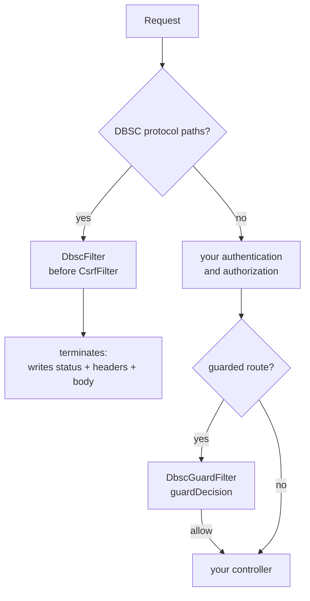

# spring-dbsc

[](https://github.com/yuukioosaka/spring-dbsc/actions/workflows/build.yml)
[](./LICENSE)

A Spring Boot **library** implementation of **DBSC (Device Bound Session
Credentials)**, built against the [W3C draft](https://w3c.github.io/webappsec-dbsc/)
and the [`dbsc-toolkit`](https://www.npmjs.com/package/dbsc-toolkit) protocol
specification.

This artifact is meant to be **embedded in an existing Spring Boot application**:
it ships no `@SpringBootApplication` and no controllers. You add it as a
dependency, call `bind()` from your own login route, and add its filters to your
own security chain.

The point of DBSC: a session cookie stolen off the wire is useless on another
device, because the session is bound to a private key that never leaves the
browser's hardware. When the owner's browser refreshes the binding and the
attacker's device cannot produce the signature, the session is demoted to `none`
and the theft is reported as `session_stolen`.

## What's implemented

| Area | Status |
|---|---|
| Native protocol | ✅ registration, refresh, well-known document |
| Hardware-backed key binding (TPM / Secure Enclave) | ✅ `ES256` + `RS256` |
| Atomic challenge consumption | ✅ in-memory + JDBC |
| Tier model + demotion-on-failure | ✅ `dbsc` / `none` |
| Route guard | ✅ opt-in per route; refuses anything not currently `dbsc`, and a bound session that omits its DBSC cookies |
| Telemetry events | ✅ 6 event types |
| Rate limiting | ✅ per-IP, with a separate failure budget |

## The protection model

DBSC — the [W3C draft](https://w3c.github.io/webappsec-dbsc/) and what Chromium
implements — is what this library implements, and this library implements *only*
that. The browser mints a key in **hardware-backed, non-extractable storage**, and
no script on the page can ever read or call it. Registering a session therefore
requires **no client code at all**: sending `Secure-Session-Registration` is the
whole handshake.

That is the guarantee, stated precisely: an attacker who steals the session cookie
cannot produce a refresh signature, and the browser cannot be made to produce one
for them. Three properties of the implementation carry it.

**A session's key is the session's key.** The key is stored once per `sessionId`
(`DeviceKey` has no other identity — re-registering replaces it), and registration
is refused outright with `SESSION_ALREADY_REGISTERED` when a key is already
present. There is no second, weaker key type and no path by which a
script-readable credential can stand in for a hardware one.

**Demotion on a failed refresh is the theft response.** A refresh whose signature
fails consumes the challenge, moves the session to `tier: none`, and emits
`session_stolen` — and the key is deliberately **kept**, because it is what makes
the next failure recognisable as a replay. The stored tier is therefore
authoritative: a key sets the *ceiling* a session can reach, not whether it is
currently protected. `dbsc.tierFor(sessionId)` reports `dbsc` only while the
session is actually trustworthy.

**The tier model has two values, not three.** `dbsc` means a hardware-backed key
is registered; `none` means nothing is bound, or a refresh signature failed. There
is no intermediate or weaker tier, and a stored value the library does not
recognise reads as `none` rather than being trusted.

### What the library does not do

Two things are easy to assume from the name, and both are false here:

- **It does not verify a per-request proof.** DBSC has none to verify: the browser
  signs only when it registers and when it refreshes, and that signature never
  leaves the browser's own protocol flow. What the library gives you is
  **freshness** — a session whose browser has stopped proving possession gets
  demoted — so the decision available to you is "is this session's tier currently
  `dbsc`?", not "did this request carry a valid proof?".
- **It does not authenticate, and it does not replace your authorization.** The
  guard refuses a request whose session is not currently DBSC-protected; it does
  not admit anyone, and it must not be the only thing in front of a route. Every
  route you guard still needs your own authentication, and DBSC's refusal is a
  step-up prompt rather than proof of who the caller is.

DBSC is **additive**: adopting the library never silently changes the behaviour of
an existing endpoint, because nothing is guarded until you declare a
`GuardedRoute`.

## Requirements

The library is compiled at the **Java 17** release level, so its class files load on
JDK 17 and every later JDK — 17, 21 and 25 all work. Java 17 is the lowest JDK Spring
Boot 3.5 supports, and it is the CI baseline.

Spring Boot 3.x.x, 4.x.x are the tested versions.

## Getting Started

### 1. Add the dependency

```xml
<dependency>
  <groupId>click.yukio.dbsc</groupId>
  <artifactId>spring-dbsc</artifactId>
  <version>0.6.0</version>
</dependency>
```

That is the whole installation. A normal Boot app picks up `DbscAutoConfiguration`
from the JAR's `META-INF/spring/org.springframework.boot.autoconfigure.AutoConfiguration.imports`
— no extra annotation.

### 2. Wire the DBSC filters into your chain

The library ships **two `OncePerRequestFilter` beans and no `SecurityFilterChain`** —
they are *not* wired into Security for you, and are not auto-registered as servlet
filters either, so a JAR that is merely on the classpath does nothing until you add
them. Nothing is registered into Spring Security for you, because *where* the filters
sit, which paths bypass authentication, and what authorization runs elsewhere in the
chain are policy decisions that belong to your application. A library-supplied chain
would either collide with yours (two chains matching `/**` is a hard startup error) or,
worse, be kept and silently replace your authorization rules.

Two beans arrive from `DbscFilterConfiguration`:

| Bean | Serves | Goes in |
|---|---|---|
| `dbscFilter` | the protocol routes (`/dbsc/**`, the well-known document) | its own protocol chain, unauthenticated |
| `dbscGuardFilter` | nothing by default — the routes you declare | your application chain, next to your authorization |

Put them where their subjects live:

```java
@Configuration
@EnableWebSecurity
public class MySecurityConfig {

    /** Protocol routes: driven by the browser, before any session exists. */
    @Bean
    @Order(0)
    public SecurityFilterChain dbscProtocolChain(HttpSecurity http, DbscFilter dbscFilter)
            throws Exception {
        http
                .securityMatcher(new OrRequestMatcher(
                        new AntPathRequestMatcher("/dbsc/**"),
                        new AntPathRequestMatcher("/.well-known/device-bound-sessions")))
                .authorizeHttpRequests(auth -> auth.anyRequest().permitAll())
                .sessionManagement(s -> s.sessionCreationPolicy(SessionCreationPolicy.STATELESS))
                .csrf(CsrfConfigurer::disable)
                // CsrfFilter, not UsernamePasswordAuthenticationFilter: a filter placed
                // relative to the latter still runs after CSRF, which would reject the
                // browser's registration POST (it carries no CSRF token) before DBSC
                // ever sees it.
                .addFilterBefore(dbscFilter, CsrfFilter.class);
        return http.build();
    }

    /** Your application, under your own authentication and authorization. */
    @Bean
    @Order(1)
    public SecurityFilterChain appChain(HttpSecurity http, DbscGuardFilter dbscGuardFilter)
            throws Exception {
        http
                .authorizeHttpRequests(auth -> auth
                        .requestMatchers("/login", "/css/**").permitAll()
                        .requestMatchers("/api/transfer").authenticated())
                // The guard, after authentication: it answers "is this session
                // currently DBSC-protected?", which is a question about a session
                // that must already exist.
                .addFilterBefore(dbscGuardFilter, CsrfFilter.class);
        return http.build();
    }

    /** The one route whose session must be device bound. */
    @Bean
    public GuardedRoute transferRequiresDbsc() {
        return GuardedRoute.at("/api/transfer");
    }
}
```

The three details that actually matter, and how each one fails:

| Detail | If you get it wrong |
|---|---|
| `OrRequestMatcher` for the protocol paths — `securityMatcher()` **sets**, it does not accumulate | Only the last path is matched; the rest fall through to your chain, which answers a Spring 403 before `DbscFilter` runs |
| `addFilterBefore(..., CsrfFilter.class)` **and** CSRF off on the protocol chain | The browser's registration POST carries no CSRF token, so a chain that applies CSRF to `/dbsc/**` rejects it before `DbscFilter` runs |
| Each bean is registered in **one** chain only | `OncePerRequestFilter` records itself in a request attribute, so the same instance in a second chain silently skips it |

**Declaring no `GuardedRoute` guards nothing**, which is the default and the reason
adoption is safe: the guard filter is then a single list lookup on every request.
Skipping the guard entirely is also fine — see
[Act on the tier](#act-on-the-tier) for the inline form, which is the same check
without a filter.

**Disable Boot's automatic servlet registration.** A `Filter` bean is picked up by the
servlet container as well as by the security chain, which would run each filter a
second time on every request:

```java
@Bean
FilterRegistrationBean<DbscFilter> dbscFilterRegistration(DbscFilter filter) {
    var registration = new FilterRegistrationBean<>(filter);
    registration.setEnabled(false);
    return registration;
}

@Bean
FilterRegistrationBean<DbscGuardFilter> dbscGuardFilterRegistration(DbscGuardFilter filter) {
    var registration = new FilterRegistrationBean<>(filter);
    registration.setEnabled(false);
    return registration;
}
```

Anchoring on `CsrfFilter.class` is not a dependency on CSRF being *enabled* — only on
it being **ordered**, which `HttpSecurity` guarantees whenever it is in the chain. It is
the earliest anchor that is still a Spring Security filter, which is what keeps DBSC's
`403` from being turned into a `401` by Security's entry point. The demo README
(`src/demo/resources/README-DEMO.md`) records what the other anchors cost.

### Examples

#### Form login (password)

Form login owns the POST that ends authentication, so the binding has to be made from
the success handler there too:

```java
@Bean
SecurityFilterChain appChain(HttpSecurity http, DbscService dbsc,
                             DbscFilter dbscFilter) throws Exception {
    http
            .authorizeHttpRequests(auth -> auth
                    .requestMatchers("/login", "/css/**").permitAll()
                    .requestMatchers("/api/transfer").authenticated())
            .formLogin(form -> form
                    .loginPage("/login")
                    .successHandler((request, response, auth) -> {
                        // The DBSC session id is minted here, independent of the
                        // application's session id, which is passed as the second
                        // argument. Keep the value if you want to call terminate()
                        // by value; otherwise read it back from the binding cookie
                        // with sessionFor(request).
                        dbsc.bind(UUID.randomUUID().toString(),
                                  request.getSession().getId(), auth.getName(),
                                  86_400_000L, request, response);
                        response.sendRedirect("/");
                    }))
            .logout(logout -> logout.logoutSuccessHandler((request, response, auth) ->
                    dbsc.sessionFor(request)
                            .ifPresent(s -> dbsc.terminate(s.id(), request, response))))
            .addFilterBefore(dbscFilter, CsrfFilter.class);
    return http.build();
}
```

`src/demo` is a complete, runnable form-login app over HTTPS, and
`src/demo/resources/README-DEMO.md` records the failure modes it exists to catch.

#### OIDC / `oauth2Login()`

DBSC binds a session that already exists, so it composes with any authentication
mechanism — including OIDC, whose callback is cross-site. `bind()` names the session
with a single-use token in the registration URL rather than a cookie, so the
registration POST Chromium issues needs no session cookie and the cross-site initiator
does not matter. There is nothing extra to wire:

```java
@Configuration
@EnableWebSecurity
public class OidcSecurityConfig {

    @Bean
    SecurityFilterChain appChain(HttpSecurity http, DbscService dbsc,
                                 DbscFilter dbscFilter) throws Exception {
        http
                .authorizeHttpRequests(auth -> auth
                        .requestMatchers("/login/**", "/oauth2/**", "/error").permitAll()
                        .requestMatchers("/api/transfer").authenticated()
                        .anyRequest().authenticated())
                .oauth2Login(oauth2 -> oauth2.successHandler((request, response, auth) -> {
                    // Force the session to exist: a login always has one, and the id is
                    // passed to bind() so the guard can tell a client that never
                    // registered apart from one that dropped its DBSC cookies.
                    String appSessionId = request.getSession().getId();
                    dbsc.bind(UUID.randomUUID().toString(), appSessionId,
                              auth.getName(), 86_400_000L, request, response);
                    response.sendRedirect("/");
                }))
                .addFilterBefore(dbscFilter, CsrfFilter.class);
        return http.build();
    }
}
```

Historically this did not work, and the reasoning is worth knowing because it explains
why the token is in the URL at all — see
[Binding behind OIDC or SAML](#binding-behind-oidc-or-saml-why-the-first-offer-fails).
`src/demo/java-oidc` is this example, runnable.

**The user id must not come from a mutable claim.** Whichever claim you read, do not
take it from `preferred_username` or `email`: the binding would change owner if the
address did. The OIDC `sub` claim is the stable choice — for `oauth2Login()` that
means setting `user-name-attribute: sub`, which is what `auth.getName()` then returns.

If your app has no `HttpSession`, pass whatever opaque id you already mint per client
for that session — `bind()` takes the application-session id as an argument and does
not care where it came from — rather than inventing one for this.

## Architecture

The protocol is served by **filters that your own Spring Security chain invokes**, not by
controllers:

| Component | Responsibility |
|---|---|
| `DbscFilter` | Owns every protocol route (`/dbsc/*`, `/.well-known/device-bound-sessions`). Terminates the chain for those paths; passes everything else through untouched. |
| `DbscGuardFilter` | Decides whether a request to a route the application declared may proceed, via `DbscService.guardDecision`. Refuses with `403` + `DBSC_REQUIRED`; passes everything else through untouched. |

`DbscService` sits below both as the HTTP facade, and `DbscProtocolEngine` below that as
the protocol itself — neither depends on Spring Security. See
[How it is wired (and why)](#how-it-is-wired-and-why) for the reasoning.

The two filters answer different questions and belong in different chains. `DbscFilter`
is about the browser's protocol flow, which runs before any session exists;
`DbscGuardFilter` is about your routes, which have one. Neither one inspects the other's
paths.

The guard is not a tier comparison, though the tier is most of it — the decision also
covers the session that dropped its DBSC cookies, which no tier check can see. See
[What the guard actually decides](#what-the-guard-actually-decides).

## Wiring it into your own app

### 1. Get the auto-configuration on the classpath

The library ships `META-INF/spring/org.springframework.boot.autoconfigure.AutoConfiguration.imports`,
so a normal Boot app picks up `DbscAutoConfiguration` with no extra annotation —
just depend on the JAR.

If you disable Boot's auto-configuration, or want the wiring visible, import it
explicitly:

```java
@SpringBootApplication
@Import(DbscAutoConfiguration.class)
public class MyApplication { ... }
```

The auto-configuration applies whenever the JAR is on the classpath. There is no
enable/disable switch on the library itself — the way to turn DBSC off is to take
the dependency out, since a half-installed filter chain that starts but does not
work is a worse failure mode than an absent one.

### 2. Bind a session from your login route

DBSC does not authenticate. It **binds a session that already exists**, so the call goes
at the end of your existing login handler — see
[The application API](#the-application-api) for what `bind()` does and why the call is
required: the id you pass is the DBSC session id, which you mint, and your application's
own session id goes alongside it so the guard can find the binding later:

```java
@PostMapping("/login")
public Session login(HttpServletRequest request, HttpServletResponse response) {
    Session session = authenticate(request);       // your own auth
    dbsc.bind(UUID.randomUUID().toString(), request.getSession().getId(),
              session.userId(), 86_400_000L, request, response);
    return session;
}
```

On logout, call `dbsc.terminate(...)` so the browser forgets the binding immediately
instead of retrying against a dead session. The record is **kept and marked revoked**, not
deleted: that is what lets a later request from the same session still be recognised as
"was bound" rather than treated as a first-time visitor:

```java
@PostMapping("/logout")
public void logout(HttpServletRequest request, HttpServletResponse response) {
    dbsc.sessionFor(request).ifPresent(s -> dbsc.terminate(s.id(), request, response));
    invalidateYourOwnSession(request);
}
```

### 3. Act on the tier

Your authorization does not change. DBSC is additional state your own code consults, and
nothing is guarded until you say so: declare a `GuardedRoute` and `dbscGuardFilter`
enforces the tier there, or read the tier inline. Both forms are in
[Act on the tier](#act-on-the-tier).

## How it is wired (and why)

DBSC is implemented as **`OncePerRequestFilter`s** rather than controllers, and they run
inside the Spring Security chain because that is where your application decides what is
reachable:



Each branch is independent. The protocol paths are served and stop there; a guarded
route additionally has to pass the guard's decision; everything else is your
application's chain, unchanged. Gating a single endpoint inline is equally valid — see
[Act on the tier](#act-on-the-tier).

The reasons for filters rather than controllers:

- **These are a protocol surface, not endpoints.** The routes must be reachable
  before any application session exists, and must answer with DBSC's own status
  contract. A filter that terminates the chain enforces that structurally: the
  routes cannot be re-mapped, shadowed by a peer controller, or re-secured.
- **403 vs 401 is load-bearing, and only a filter can guarantee it.** Chromium
  treats a 401 on the refresh route as fatal and terminates the session, so DBSC
  must answer 403. If Spring Security handled these paths itself it would answer
  401 first. `DbscFilter` is registered *before* Spring Security's CSRF filter — the
  earliest anchor that is still a Security filter — so nothing upstream can reject the
  browser's registration POST or replace that status.
- **It owns no state the application needs to configure.** The filters are handed the
  protocol surface and the list of guarded paths, so they add no ordering constraints to
  your chain beyond the two above and no policy of its own over your routes.

### Using your own `SecurityFilterChain`

That is the only way to use the library — [Getting Started](#getting-started) is the
full worked example, and the two chains there are the shape to copy. The four details
worth restating here, because each one fails silently:

- **The protocol paths belong in a chain with CSRF disabled.** The browser's
  registration POST carries no CSRF token, so a chain that applies CSRF to `/dbsc/**`
  rejects it with `403` before `DbscFilter` ever runs — and the status looks like a
  DBSC refusal.
- **`dbscFilter` goes before `CsrfFilter`**, not merely before authentication.
  Anything `addFilterBefore` anchors on is still ordered *after* CSRF, so the
  registration POST would be rejected first.
- **`dbscGuardFilter` goes in the application chain, after authentication.** It asks
  whether an existing session is protected; running it before authentication would
  make it answer questions about a session that has not been established yet.
- **Each filter goes in exactly one chain.** `OncePerRequestFilter` records itself in a
  request attribute, so the same instance in a second chain is skipped without a word.

### Replace the collaborators you have opinions about

`DbscAutoConfiguration` backs off with `@ConditionalOnMissingBean` on every
bean, so defining your own replaces the default. The ones most worth replacing:

| Bean | Default | Replace when |
|---|---|---|
| `StorageAdapter` | JDBC when a `DataSource` is present, else in-memory | You already have a key/session store — implement the interface. The hard requirements are an **atomic** `consumeChallenge`, and `getSessionByAppSessionId` honouring the one-binding-per-application-session rule (the guard relies on it to spot an omitted cookie) |
| `RateLimiter` | In-memory, per-IP | You run more than one process (the in-memory limiter is per-JVM) — or you use a gateway/bucket you already have |
| `CookieScope` | Resolved from `secure` / `cookie-scope` / `cookie-domain` | You build cookie names or attributes yourself |
| `ChallengeService`, `DbscProtocolEngine`, `TelemetryPublisher` | Library defaults | You need different challenge or telemetry behaviour |
| `Clock` | `Clock.systemUTC()` | You need to freeze time. Override the bean **named `dbscClock`** (`@ConditionalOnMissingBean(name = "dbscClock")`) |

```java
@Bean
StorageAdapter dbscStorage(MyRedisClient redis) {
    return new RedisStorageAdapter(redis);   // must make consumeChallenge atomic
}
```

`DbscService` itself is also `@ConditionalOnMissingBean`, but it is a plain
facade — wrapping or replacing it is rarely worth it.

## The application API

Three calls are the whole integration surface. The examples above show where they go;
this is what they do.

| Call | When |
|---|---|
| `dbsc.bind(sessionId, appSessionId, userId, ttlMillis, request, response)` | From an authenticated request, usually at the end of your login flow. `sessionId` is the **DBSC** session id, which you mint; `appSessionId` is your application's own session id |
| `dbsc.terminate(sessionId, request, response)` | On logout, so the browser forgets the binding instead of retrying against a dead session |
| `dbsc.sessionFor(request)` / `dbsc.tierFor(sessionId)` | Whenever your own code wants to know whether this browser is bound |
| `dbsc.guardDecision(request, appSessionId)` | When you want the guard's decision without the filter, e.g. to branch on *why* a request was refused |
| `GuardedRoute.at(path)` | To have the filter enforce the tier on a whole route instead |

**The two ids are different concepts and the library never conflates them.** `sessionId`
identifies the DBSC session and the stored device key; `appSessionId` identifies *your*
session, and it is only recorded so the guard can spot a request that dropped its DBSC
cookies. Nothing requires them to match, and nothing derives one from the other:

```
JSESSIONID=72234F6E…             your session   -> appSessionId
__Host-dbsc-session=3D99F29D…    the binding    -> sessionId
```

Mint the DBSC id however you like — a UUID is the obvious choice — and pass your own
session id alongside it. Keep the DBSC id if you want to call `terminate()` by value;
otherwise read it back from the binding cookie with `sessionFor(request)`.

**`bind()` is the only thing that starts a binding.** It persists the session record,
mints a single-use registration token, sets the challenge + binding cookies, and adds
`Secure-Session-Registration` naming `/dbsc/regist/<token>`; Chromium then calls that
route on its own within about a second, with no client code to write. `DbscFilter` never
adds that header to your application's own responses, so a login flow that never calls
`bind()` produces no binding at all.

The call is cheap but not free — one challenge and two cookie writes — so a route that
binds on every request is fine, and keeping it off hot paths is better. It is **not**
idempotent: each call writes a record, and a second call under the same `sessionId`
replaces the first. That is deliberate, so a re-login can re-key an existing session.

### Act on the tier

Two ways to enforce it, and they check the same thing. **Declaring a route** hands the
decision to `DbscGuardFilter`, which refuses with `403` and `DBSC_REQUIRED` before your
handler runs:

```java
@Bean
GuardedRoute transferRequiresDbsc() {
    return GuardedRoute.at("/api/transfer");
}
```

**Reading the tier inline** is for a route where a blanket refusal is the wrong answer —
where the response should differ, or where only part of the handler needs protection:

```java
@PostMapping("/api/transfer")
public ResponseEntity<?> transfer(@RequestBody Transfer body, HttpServletRequest request) {
    Optional<Session> session = dbsc.sessionFor(request);
    if (session.isEmpty() || dbsc.tierFor(session.get().id()) != ProtectionTier.DBSC) {
        // Signed in, but this browser is not proving possession of a bound key.
        return ResponseEntity.status(HttpStatus.FORBIDDEN).body(stepUpOrReauthenticate());
    }
    return transferService.execute(body);
}
```

#### What the guard actually decides

The tier check above is necessary but not sufficient, because "tier is `none`" covers two
situations that must be answered differently:

| Situation | Decision |
|---|---|
| Registered, currently proving possession | allow |
| Registered once, then demoted (or revoked) | **refuse** |
| Bound, but the record is gone | **refuse** — it was bound and is not any more |
| `bind()` ran, registration has not completed yet | allow — the pre-registration window |
| No DBSC cookie, and no binding for this application session | allow — DBSC is additive |
| No DBSC cookie, but a binding exists for this application session | **refuse** |

`DbscGuardFilter` therefore delegates to `dbsc.guardDecision(request, appSessionId)`
rather than comparing tiers itself. Use the same call if you want to branch on the reason
(`GuardDecision.Reason` tells you which row above applied) instead of getting a flat
`403`.

The last two rows are the point. **Dropping the DBSC cookies is something the client
controls**, so "no cookie" must not be read as "no binding" — otherwise a stolen
`JSESSIONID` could regain unbound access just by not presenting the cookie it stole. That
is why `bind()` records your application's session id, and why the guard reads it:
without it, a first-time visitor and a client that deliberately omitted its cookies are
indistinguishable.

Both forms make the same decision, so these hold for either:

- **It is a step-up decision, not an authentication one.** A `dbsc` tier never
  substitutes for being authenticated; read it *in addition to* your own checks, as
  above. That is also why the guard lives in the application chain rather than the
  protocol one, and why its refusal is a `403` with `DBSC_REQUIRED` rather than a
  `401` — a `401` reads as signed out, and Chromium treats one on the refresh route
  as fatal.
- **The tier is the live answer, not the value on the record.** It accounts for the
  refresh cadence and the grace window, so a session whose browser has stopped
  refreshing reads `none` — which is the demotion you are actually trying to surface.
  A session with a perfectly good registered key reads `none` too, once it has
  lapsed.
- **An unregistered client is allowed through, by design.** A browser without DBSC
  support (or a user who has just logged in, before registration completes) is
  legitimately unbound. This is what lets one application serve both populations:
  DBSC-capable clients get the binding enforced, everyone else runs on the plain
  session as before. Deciding that a browser which *cannot* do DBSC is refused is a
  policy choice the library deliberately does not make for you.

If your application cannot act on a weaker tier — for example a compliance rule that
says a stolen cookie must never be usable — say so explicitly rather than assuming the
handshake alone covers it: the protocol routes and `bind()` are what the library does,
and it is the guard or a check like the block above that turns a bound session into an
enforced one.

## Configuration

All keys are prefixed `dbsc`. Defaults match the toolkit spec.

| Key | Default | Notes |
|---|---|---|
| `secure` | `true` | `__Host-` cookies + `Secure`. **Turn off only for localhost HTTP** |
| `cookie-scope` | `host` | `site` enables multi-subdomain and requires `cookie-domain` |
| `cookie-domain` | — | e.g. `example.com`; required for `site` scope |
| `registration-path` | `/dbsc/regist` | **prefix** for the registration route, not a full path: the advertised route is `<prefix>/<token>` |
| `refresh-path` | `/dbsc/refresh` | also the `refresh_url` in the JSON config |
| `binding-cookie-ttl` | `10m` | lifetime of the binding cookie, and the window after which an unrefreshed session demotes. Also the refresh cadence the browser settles into |
| `registration-cookie-ttl` | `24h` | lifetime of the single-use registration token. The token is consumed by a successful registration; this is only the ceiling for one that never completes |
| `challenge-ttl` | `5m` | lifetime of a challenge JTI |
| `refresh-grace` | `30s` | softens the freshness poll across a refresh |
| `session-ttl` | `7d` | default lifetime applied by `bind()` when the caller does not set one |
| `rate-limit.enabled` | `true` | |
| `rate-limit.capacity` | `30` | per IP, per window |
| `rate-limit.failure-capacity` | `15` | **failed** attempts per IP, per window — trips long before `capacity` does |
| `rate-limit.window` | `1m` | |
| `storage` | `jdbc` when a `DataSource` is present | `memory` for tests and local dev only |
| `trust-forwarded-headers` | `false` | believe `X-Forwarded-For` / `X-Forwarded-Proto`. Leave off unless a reverse proxy is known to overwrite them — they drive the IP used for rate limiting |

### Storage

With a `DataSource` on the classpath, sessions, keys and challenges all live in the
database (`dbsc.storage: jdbc`).

For tests and local dev, `dbsc.storage: memory` swaps in a heap-backed store.
**Not for production**: every restart breaks live sessions, because the browser
still holds a cookie for a key the server no longer remembers.

```yaml
dbsc:
  storage: jdbc          # or: memory
  secure: true
  cookie-scope: site
  cookie-domain: example.com
```

#### Schema

The tables are created on startup by `JdbcStorageAdapter.initialize()`, which issues
`CREATE TABLE IF NOT EXISTS` and is safe to run on every boot. A fresh database needs
no setup.

That default is convenient, but in production the schema should be owned by a migration
tool (Flyway, Liquibase, or whatever the application already uses), for two reasons:

- The runtime database user otherwise needs **DDL rights**, which many production
  setups deliberately withhold.
- Schema changes then get reviewed, versioned and rolled out like every other change,
  instead of silently appearing on the first boot of a new release.

The DDL is shipped for exactly that, at
[`src/main/resources/db/migration/V1__dbsc_storage.sql`](./src/main/resources/db/migration/V1__dbsc_storage.sql):

| Table | Contents |
|---|---|
| `dbsc_sessions` | one row per bound session (`id` PK, `app_session_id`, `user_id`, `tier`, `revoked`, timestamps). `app_session_id` is uniquely indexed, so there is at most one binding per application session |
| `dbsc_device_keys` | the registered hardware key it holds — `session_id` PK, so **one key per session** |
| `dbsc_challenges` | outstanding JTIs, with the `consumed` flag that makes consumption atomic |

The `dbsc_sessions` table references the DBSC session id (`id`) and your application's
session id (`app_session_id`) as two independent columns — see
[The application API](#the-application-api). Only `id` is a foreign key target;
`app_session_id` exists solely to answer "is there a binding for this application
session?" when a request arrives without DBSC cookies.

> **Upgrading from a build before 0.6.0:** `dbsc_sessions` gained `app_session_id`
> (`NOT NULL`) and `revoked` (`BOOLEAN NOT NULL`), plus a unique index on
> `app_session_id`. `CREATE TABLE IF NOT EXISTS` will **not** add them to an existing
> table — it silently skips it, and the app then fails at runtime on the missing column.
> Apply an `ALTER TABLE` before deploying:
>
> ```sql
> ALTER TABLE dbsc_sessions ADD COLUMN app_session_id VARCHAR(255);
> ALTER TABLE dbsc_sessions ADD COLUMN revoked BOOLEAN NOT NULL DEFAULT false;
> UPDATE dbsc_sessions SET app_session_id = id WHERE app_session_id IS NULL;
> ALTER TABLE dbsc_sessions ALTER COLUMN app_session_id SET NOT NULL;
>
> > CREATE UNIQUE INDEX dbsc_sessions_app_session_idx ON dbsc_sessions (app_session_id);
> ```
>
> The same release added a new table, `dbsc_registration_tokens`, which holds the
> single-use registration tokens. `CREATE TABLE IF NOT EXISTS` creates it on its own, so
> no manual step is needed for it — but note that `__Host-dbsc-reg` no longer exists, so
> any code or test of yours referencing that cookie name must be updated.
>
> Existing rows are backfilled with their own DBSC id as the application session id,
> which is a safe placeholder: it preserves the "a binding exists" answer for those
> sessions and can never collide, since `id` is already unique. Those sessions will be
> refused once by the guard and recover on the next login, which re-binds them with the
> real application session id.

The file is a plain `CREATE TABLE IF NOT EXISTS` migration: drop it into your
migration tool's directory, or run its statements however you already run schema
changes. It is **byte-identical** to what `initialize()` issues and both are
idempotent, so there is no conflict either way — applying it and then starting the app
leaves the schema unchanged, and you can adopt it on an existing deployment without a
baseline step.

The SQL is deliberately portable — no vendor-specific types, no sequences — so it works
on PostgreSQL, MySQL, MariaDB, H2 and SQL Server. Timestamps are `BIGINT` epoch
milliseconds throughout, matching how the protocol carries them.

If you would rather not carry the migration at all, `initialize()` is also safe to call
yourself from a schema-management hook — the DDL statements are quoted at the top of
`JdbcStorageAdapter`.

## Binding behind OIDC or SAML: why the first offer fails

This section explains why the registration token travels in the URL rather than in a
cookie. The failure it describes is real and worth understanding — it is what the design
solves — but with the current library there is nothing for you to do about it.

Chromium makes a DBSC request inherit the **initiator** of the request that produced
it. For an OIDC or SAML login, the response carrying your `Secure-Session-Registration`
header is the **callback** — and the callback's initiator is the identity provider,
not your site. So the registration POST Chromium fires in response counts as
**cross-site**, and Chromium withholds your `SameSite=Lax` session cookie from it:

```
GET  /login/oauth2/code/entraid   302   session cookie set
POST /dbsc/regist/<token>         200   session cookie NOT sent
```

A server-side redirect does **not** help: `302`/`303` to your own page keeps the
callback as the initiator. Only a navigation the *browser* issues on its own — a
click, a page load, a script-driven location change — resets it.

### How the token in the path removes the problem

An earlier design named the session with a `__Host-dbsc-reg` cookie. Cross-site, that
cookie was withheld along with `JSESSIONID`, so the registration route saw a request
with no session and answered `403` — and Chromium records that failure as permanent and
does not retry for the rest of that login, leaving the session at `tier: none` no matter
how long it lives.

`bind()` no longer sets that cookie. It mints a **single-use registration token** and
advertises the session's identity in the registration **URL**:

```
POST /dbsc/regist/1234-56789-01234-56789
```

The POST is resolvable from the path alone, so it does not matter that the session
cookie was withheld and the cross-site initiator stops being a problem. Binding in the
OIDC success handler — the obvious place — now works, with no relay hop and no
application-side workaround.

Two consequences worth knowing:

- **The token is single-use**, consumed by a successful registration. A second
  registration on an already-registered session is an error
  (`SESSION_ALREADY_REGISTERED`) — that is the protocol, not a limitation.
- **`registration-path` is a prefix**, not a fixed path. The concrete route is
  `<prefix>/<token>`. Never build the header yourself; `bind()` does it, and
  `DbscService.registrationPathFor(token)` is the accessor if you need it.

The challenge cookie is unaffected and still required: it is how the server knows which
JTI was signed.

For form login none of this ever applied. Form login owns the POST the browser made to
your own origin, so the success handler *is* same-site and a single `bind()` there is
complete.

`bind()` is safe to call more than once: it costs one challenge plus two cookie writes
and a fresh token each time, and Chromium ignores the offer once the session has
registered. Each call writes its own session record, so a second call under the same id
replaces the first. Keep it off hot paths, and never call it from an unauthenticated
route — `bind()` trusts its arguments.

## Things worth knowing

A few behaviours are load-bearing and easy to get wrong if you reimplement or
extend this:

- **Never 401 on the refresh route.** Chromium ignores 401 there and the
  session silently dies. Every DBSC failure is 403, except a structurally incomplete
  request (400) and a tripped rate limit (429).
- **A failed refresh signature must consume the challenge and demote to
  `none`.** That demotion is the actual theft response, not a side effect.
- **`200` with no JSON body on a protocol route means opt-out**, and the browser
  drops the session. Always return the JSON config on success.
- **The `attributes` string in the JSON config must match the real
  `Set-Cookie` bytes**, so the browser's cookie matcher recognises it. It
  deliberately excludes `Max-Age`, which the spec's match set does not include.
- **A key can only be registered once per session.** A second registration is
  refused with `SESSION_ALREADY_REGISTERED`; re-binding means starting a new session.
- **`tier` is what makes a session protected, not the presence of a key.** A
  demoted session keeps its key on purpose (so a later failure is still recognisable
  as `session_stolen`), which is why `tierFor()` reads the stored tier rather than
  inferring protection from the key.

## License

[MIT](./LICENSE).
